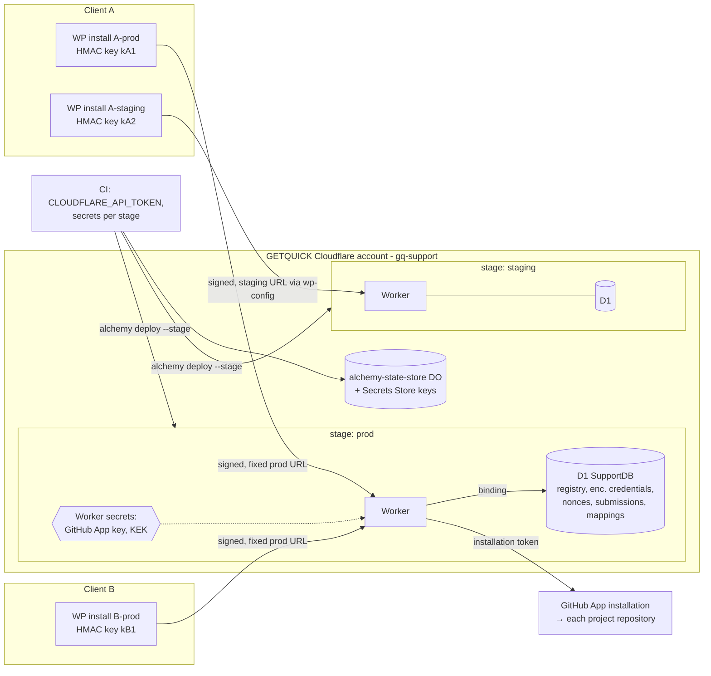

# Cloudflare isolation and Alchemy provisioning

- **Research target:** GitHub issue [#9](https://github.com/Quick-Release/gq-support/issues/9)
- **Access date:** 2026-09-28. Every limit and price below was read on this date. Re-check them before relying on them.
- **Installed stack:** `alchemy@2.0.0-beta.77`, `effect@4.0.0-rc.115` (`worker/package.json`). Alchemy facts come from the installed source under `worker/node_modules/alchemy/src/`. Paths are relative to that directory.
- **Inputs:** [CONTEXT.md](../../CONTEXT.md), [ADR 0009](../adr/0009-project-repository-intake-and-reporter-scoped-projection.md), [ADR 0010](../adr/0010-installation-scoped-attestation-not-cross-site-identity.md), [support security design](../support-security-design.md), [support API contract](../support-api-contract.md), [support domain design](../support-domain-design.md).

## Decision summary

1. **Topology.** Deploy **one shared Worker and one shared D1 database per environment stage** (`staging`, `prod`, plus personal `dev_*` stages) in a GETQUICK-owned Cloudflare account. Every Client uses the same resources. Isolation between Clients and between installations is enforced in the application: the verified installation credential resolves the Client, installation and repository from trusted rows, and every query is keyed by that installation.
2. **Dedicated resources are an escalation path.** Moving a Client to its own resources is a documented migration with objective triggers. The next step is a per-Client D1 bound to the shared Worker (option 2). A Worker in the Client's own account (option 3) is a contractual exception, not a default.
3. **Minimum infrastructure for the first slice.**
   - Required: one Worker and one D1 database.
   - Decided by #11, not provisioned by default: Queues.
   - Deferred until #15: R2.
   - Rejected for this purpose: KV, Durable Objects, Workers for Platforms, and a per-installation Secrets Store secret.
4. **Secrets.**
   - The **GitHub App private key** is a per-stage Worker secret, injected by Alchemy from the deploy environment.
   - **Per-installation HMAC keys** are **not** Worker secrets. They are rows in D1, encrypted with AES-GCM under a key-encryption key (KEK). The KEK is a Worker secret. Issuing, rotating or revoking an installation credential therefore needs no redeploy and does not count against the Worker's variable limit.
5. **Alchemy.**
   - Stages are chosen with `--stage` / `$ALCHEMY_STAGE`.
   - D1 migrations are applied by Alchemy on deploy.
   - `RemovalPolicy.retain` protects the D1 database on `staging` and `prod`.
   - Secrets are passed as `Config.redacted` from CI.
   - No per-Client resources exist in the stack, so `alchemy destroy` cannot delete a single Client's data.

## Verified platform facts

### Workers

| Fact | Value | Source |
|---|---|---|
| Paid plan | $5/month. Includes 10M requests (+$0.30/M) and 30M CPU-ms (+$0.02/M). Billed per account, not per script. | [Workers pricing](https://developers.cloudflare.com/workers/platform/pricing/) |
| Workers per account | 100 on Free, 500 on Paid. "If you need a higher Worker limit, use Workers for Platforms." | [Workers limits](https://developers.cloudflare.com/workers/platform/limits/) |
| Variables (secrets + text) per Worker | 64 on Free, 128 on Paid. 5 KB per variable. | [Workers limits](https://developers.cloudflare.com/workers/platform/limits/) |
| Bindings | Declared in configuration and changed only by a deploy ("When you deploy a change to your Worker, and only change its bindings…"). The docs describe no way to bind a resource by name at runtime. | [Bindings](https://developers.cloudflare.com/workers/runtime-apis/bindings/) |
| Binding count | About 1 MB of script metadata at about 150 bytes per binding, so "up to ~5,000 D1 databases to a single Worker script". | [D1 limits, footnote](https://developers.cloudflare.com/d1/platform/limits/) |
| Secrets | "encrypted text values", "not visible within Wrangler or Cloudflare dashboard after you define them" | [Worker secrets](https://developers.cloudflare.com/workers/configuration/secrets/) |
| Workers for Platforms | $25/month. Dispatch namespace for "your customers' Workers". Aimed at untrusted customer code. | [WfP](https://developers.cloudflare.com/cloudflare-for-platforms/workers-for-platforms/how-workers-for-platforms-works/), [pricing](https://developers.cloudflare.com/cloudflare-for-platforms/workers-for-platforms/reference/pricing/) |

### D1

| Fact | Value | Source |
|---|---|---|
| Pricing (Paid) | Reads: 25B/month included, then $0.001/M rows. Writes: 50M/month included, then $1.00/M rows. Storage: 5 GB included, then $0.75/GB-month. No charge for idle databases. | [D1 pricing](https://developers.cloudflare.com/d1/platform/pricing/) |
| Databases per account | 50,000 on Paid, 10 on Free | [D1 limits](https://developers.cloudflare.com/d1/platform/limits/) |
| Max size | 10 GB per database on Paid, 500 MB on Free. "cannot be further increased" | [D1 limits](https://developers.cloudflare.com/d1/platform/limits/) |
| Concurrency | Each database is single-threaded | [D1 limits](https://developers.cloudflare.com/d1/platform/limits/) |
| Per-tenant pattern | "designed for horizontal scale out across multiple, smaller (10 GB) databases, such as per-user, per-tenant or per-entity databases" | [D1 limits](https://developers.cloudflare.com/d1/platform/limits/) |
| Backup | Time Travel: 30 days on Paid, 7 on Free. Max 10 restores per 10 minutes. | [D1 limits](https://developers.cloudflare.com/d1/platform/limits/) |
| Location | Jurisdictions `eu` and `fedramp` are set at creation only. "Workers may still access the database constrained to a jurisdiction from anywhere." A location hint "does not guarantee" placement. | [D1 data location](https://developers.cloudflare.com/d1/configuration/data-location/) |

### Queues, R2, KV, Durable Objects, rate limiting, Secrets Store

| Service | Relevant facts | Source |
|---|---|---|
| Queues | Paid: 1M operations/month included, then $0.40/M, and delivery takes 3 operations. Free: 10k operations/day. Up to 10,000 queues per account and 128 KB per message. `max_retries` defaults to 3. "Without a DLQ configured, messages that reach the retry limit are deleted permanently." Delivery is "at least once". | [pricing](https://developers.cloudflare.com/queues/platform/pricing/), [limits](https://developers.cloudflare.com/queues/platform/limits/), [DLQ](https://developers.cloudflare.com/queues/configuration/dead-letter-queues/), [delivery](https://developers.cloudflare.com/queues/reference/delivery-guarantees/) |
| R2 | "By default, buckets are never publicly accessible." Jurisdiction restrictions exist, but "Location Hints are a best effort". Presigned URLs last from 1 s to 7 days and only work on the S3 API domain. | [public buckets](https://developers.cloudflare.com/r2/buckets/public-buckets/), [data location](https://developers.cloudflare.com/r2/reference/data-location/), [presigned URLs](https://developers.cloudflare.com/r2/api/s3/presigned-urls/) |
| KV | "Changes may take up to 60 seconds or more to be visible". "not ideal for applications where you need support for atomic operations" | [How KV works](https://developers.cloudflare.com/kv/concepts/how-kv-works/) |
| Durable Objects | Available on Free (SQLite only) and Paid. Each object is "globally unique, single-threaded" and has strongly consistent storage. | [DO pricing](https://developers.cloudflare.com/durable-objects/platform/pricing/), [concepts](https://developers.cloudflare.com/durable-objects/concepts/what-are-durable-objects/) |
| Rate Limiting binding | Period of 10 or 60 s. The limit is "local to the Cloudflare location" and "permissive, eventually consistent, and intentionally designed to not be used as an accurate accounting system". | [Rate limit binding](https://developers.cloudflare.com/workers/runtime-apis/bindings/rate-limit/) |
| Secrets Store | "Available in open beta". "up to 100 secrets per account … only be one store per account". Each secret can be up to 65,536 bytes. No pricing is published (not verified). | [Secrets Store](https://developers.cloudflare.com/secrets-store/), [manage secrets](https://developers.cloudflare.com/secrets-store/manage-secrets/) |

### Account and token scoping

- Account API token permissions are granted per product group with Read or Edit: Workers Scripts, D1, Queues, KV, R2, and Secrets Store. I found no documentation of a token limited to a single Worker script or a single D1 database, so a deploy token reaches every Worker and D1 in its account (not verified as impossible). [Token permissions](https://developers.cloudflare.com/fundamentals/api/reference/permissions/)
- R2 tokens are the exception. They can be scoped to "specific buckets". [R2 tokens](https://developers.cloudflare.com/r2/api/tokens/)
- Resource-scoped member roles are "currently in Beta" and cover only Access, Tunnel and Mesh. [Roles](https://developers.cloudflare.com/fundamentals/manage-members/roles/)
- Data localization: the Data Localization Suite is an "Enterprise-only paid add-on". Workers run "in a data center closest to where the request was received" by default. [DLS](https://developers.cloudflare.com/data-localization/), [placement](https://developers.cloudflare.com/workers/configuration/placement/)

### Alchemy 2.0.0-beta.77 (installed source)

| Concern | Behaviour | Source |
|---|---|---|
| Stage | Taken from `--stage`, then `$ALCHEMY_STAGE`, then `live_$USER` (deploy) or `dev_$USER` (`alchemy dev`). `$STAGE` is ignored. The value must match `[a-z0-9]+([-_a-z0-9]+)*`. | `Cli/commands/flags.ts:25-76` |
| Physical names | `${stack}-${logicalId}-${stage}-` plus a 16-character base32 suffix derived from a per-resource instance id stored in state. Stages cannot collide. An explicit `name` overrides the generated one. | `PhysicalName.ts:66-101` |
| State | `Cloudflare.state()` deploys an `alchemy-state-store` Worker with a Durable Object. There is one object per stack, and keys are prefixed by stage. Entries are AES-CTR encrypted with a key held in the account's Secrets Store (`AlchemyStateStoreEncryptionKey`, `AlchemyStateStoreToken`). If decryption fails, the entry is treated as missing ("users may lose some data"). | `Cloudflare/StateStore/State.ts`, `Store.ts:39-80, 282-289`, `Token.ts` |
| D1 | `Cloudflare.D1.Database(id, { name?, jurisdiction?, primaryLocationHint?, readReplication?, migrations? })`. Migrations run on deploy and are tracked in `__alchemy_migrations`. Changing `jurisdiction`, the location hint or an explicit `name` **replaces** the database. | `Cloudflare/D1/Database.ts:51-213, 285-291` |
| Binding | Inside the Worker's init effect, `yield* Cloudflare.D1.QueryDatabase(DB)` registers the binding at deploy time and reads `env[LogicalId]` at runtime. The binding layer must be provided. | `Cloudflare/D1/QueryDatabaseBinding.ts:20-33`, `Cloudflare/Queues/Queue.ts:80-105` |
| Queues | `Queue(id, { name? })`. The consumer is `consumeQueueMessages(Q, { maxRetries, retryDelay, deadLetterQueue, … }, handler)`, where `deadLetterQueue` is a queue name. There is one Worker consumer per queue. | `Cloudflare/Queues/Queue.ts`, `EventSource.ts:22-115`, `Consumer.ts:24-66` |
| Secrets | A `Config.redacted(...)` read in the init effect is resolved from the deploy environment and bound as `secret_text`. A `Redacted` value in `env` also becomes `secret_text`. There is no `ALCHEMY_PASSWORD` in v2. | `Cloudflare/Workers/Worker.ts:808-834`, `Platform.ts:553-593` |
| Deletion | `resource.pipe(RemovalPolicy.retain(stack.stage === "prod"))` skips the provider delete. `alchemy destroy --stage X` removes only the resources in state for that stage. A non-empty R2 bucket is kept unless `forceDestroy` is set. | `RemovalPolicy.ts:1-120`, `Destroy.ts`, `Plan.ts:2127-2138` |
| Adoption | D1, Queue, KV and R2 are adopted **silently by name** when there is no state. Workers need `--adopt` because they check an ownership tag. `renamedFrom` moves a logical id without replacing the resource. | `AdoptPolicy.ts`, `Cloudflare/D1/Database.ts:373-390`, `Rename.ts` |
| Loops | Resources are effects, so a stack can loop over a Client list. A duplicate logical id silently returns the first resource (`TODO(sam): check if props are different and die`). | `Resource.ts:370-397` |
| Credentials | `CLOUDFLARE_ACCOUNT_ID` plus `CLOUDFLARE_API_TOKEN`, or an Alchemy profile. With `CI=true`, only the environment is used. No minimal permission list is documented. | `Auth/Resolve.ts:50-110`, `Cloudflare/Auth/AuthProvider.ts` |
| Local dev | `alchemy dev` emulates D1, Queues, KV, R2, secrets and rate limits on workerd, and applies D1 migrations locally. | `Cloudflare/LocalRuntime.ts`, `Cloudflare/Workers/RuntimeBindings.ts` |

## Compared topologies

| Criterion | 1. Shared Worker + shared D1, scoped in the app (**selected**) | 2. Shared Worker + dedicated D1 per Client | 3. Dedicated Worker (+ D1) per Client/environment |
|---|---|---|---|
| Isolation / blast radius | A logic bug in scoping can cross Clients. Mitigated by one scoping choke point and the isolation tests below. A stolen installation key is confined to its installation (ADR 0010) in every option. | The database boundary stops a query-scoping bug from reading another Client's rows. The Worker, the KEK and the GitHub App key are still shared. | Strongest in-account boundary. A code bug cannot reach another Client's binding. The deploy token still reaches every Worker in the account. |
| Routing | Fixed service URL. The API contract already makes the base URL a plugin constant. | The Worker must select `env["DB_<client>"]` from the verified credential. Bindings are static, so **each new Client is a redeploy**, and the credential lookup itself needs a shared registry. | A per-Client URL. This conflicts with the contract's single fixed URL unless each site sets `GQ_SUPPORT_SERVICE_URL` in `wp-config.php`. |
| Provisioning effort | Onboarding is a data operation (registry rows plus a credential). No deploy. | One D1, one binding and one deploy per Client. | One Worker, its secrets (including a copy of the GitHub App key) and its resources per Client and environment. |
| Limits | One 10 GB database, single-threaded. Text-only reports put this far off. | About 5,000 bindings per Worker. 50,000 databases per account. | 500 Workers per account on Paid. The GitHub App key is duplicated across up to 500 scripts. |
| Migration fan-out | One migration per stage. | N migrations per deploy. A partial failure leaves Clients on mixed schema versions. | N deploys and N migrations. |
| Observability | One log stream. Correlation IDs carry installation and Client. | Same as option 1. | N log streams. Fleet dashboards need aggregation. |
| Backup / restore | Time Travel restores **every** Client at once. A per-Client restore needs a selective replay. | Per-Client Time Travel restore. | Per-Client restore. |
| Offboarding | Revoke the credentials and delete or retain rows per #16. No infrastructure change. | Also drop the binding and the database, with a redeploy. | Destroy that Client's resources. |
| Noisy neighbour | Shared single-threaded database. Per-installation rate limits (security design) bound this. | Isolated storage. Shared Worker CPU is effectively unbounded. | Fully isolated. |
| Cost at 50 Clients × 2 environments | $5/month base. Usage is well inside the included allowance (see the cost section). | $5 base. Idle databases are free. | $5 base: Worker pricing is per account, so cost is **not** the discriminator. Effort and fan-out are. |

**In each Client's own Cloudflare account** (a variant of option 3): the strongest organisational separation, and the Client holds the data. It also means the GitHub App private key would live in accounts GETQUICK does not control, a separate state store and deploy token per Client, and fleet rollouts across accounts. That conflicts with requirement 6 on the map, which keeps broad provider credentials centrally managed. **Rejected as a default.** Allowed only for a contractual requirement, and then deployed as a separate stack with Client-held credentials and a Client-scoped GitHub App installation.

**Why option 1 now.** Accepted decisions already make the application the isolation boundary:

- ADR 0009 makes operational records, not the repository or label, the authorization source.
- ADR 0010 resolves the Client from the verified credential.
- A shared repository across installations of one Client already requires row-level scoping *inside* a Client.

Per-Client databases would not remove that scoping, only add a second layer. Options 2 and 3 cost a redeploy for every onboarding, which is the opposite of #7's operator-approved pairing flow.

### Triggers to move a Client to option 2 (or to the own-account variant)

Any one of these triggers the move:

- A contract requires physical data separation, a Client-specific jurisdiction, or Client-controlled backups.
- A Client needs a per-Client restore or legal hold that selective replay cannot satisfy.
- The shared D1 reaches 50% of 10 GB, or its p95 query latency exceeds the budget #18/#20 set, and one Client dominates the load.
- One Client's rate-limited traffic still measurably degrades other Clients (#20 alerting).

## Resource inventory

| Resource | Status | Responsibility |
|---|---|---|
| Worker `Worker` (one per stage) | **Required now** | Signed intake/read API, GitHub App adapter, and later the webhook receiver (#12). |
| D1 `SupportDB` (one per stage) | **Required now** | Operational records that ADR 0009 makes mandatory: the installation registry (installation → Client, environment, repository), encrypted credentials, the replay-nonce table, Submission ID idempotency, and the Reporter-to-issue mapping. Schema is owned by #10. Unique constraints give atomic replay and idempotency checks without a Durable Object. |
| Worker secrets `GITHUB_APP_ID`, `GITHUB_APP_PRIVATE_KEY`, `CREDENTIAL_KEK_V1` | **Required now** | Per stage, from the CI secret store, through `Config.redacted`. |
| Cron trigger on the same Worker | Optional, #11 | Outbox sweep and reconciliation if #11 picks a D1 outbox. |
| Queue `Delivery` + DLQ `DeliveryDLQ` | **Optional later**, decided by #11 | Only if #11 rejects synchronous or outbox-sweep delivery. If added, a DLQ is mandatory, because without one exhausted messages are "deleted permanently". |
| R2 bucket | **Deferred** to #15 | Private attachments, with #16 retention applied first. |
| Rate Limiting binding | Optional coarse shield | Cheap edge flood damping only. It is "not … an accurate accounting system", so the per-installation and per-subject quotas the security design needs are counted in D1. |
| KV | **Rejected** | It is eventually consistent (60 s or more), so it cannot hold replay, idempotency or revocation state. |
| Durable Objects / Workflows | **Rejected for now** | D1 unique constraints cover atomic checks. Reconsider only if single-threaded D1 contention is measured. |
| Secrets Store secret per installation | **Rejected** | 100 secrets per account, one store per account, and the Alchemy state store already uses two. Bindings are static, so every onboarding would be a redeploy. |
| Workers for Platforms | **Rejected** | Built for untrusted customer code, costs $25/month, and makes each Client a script. |

## Secret ownership

| Secret | Owner and location | Never |
|---|---|---|
| GitHub App private key | Operators. Held in the CI secret store per stage and bound as the Worker `secret_text` `GITHUB_APP_PRIVATE_KEY` (about 1.7 KB, under the 5 KB limit). Staging and prod use **different GitHub Apps or keys**. | On WordPress sites, in D1, in logs, or in Alchemy state as plaintext. The Alchemy DO state encrypts it, but see the risk below. |
| KEK (`CREDENTIAL_KEK_V<n>`) | Operators. A 256-bit Worker secret per stage, versioned so rotation re-wraps rows. | Stored next to the rows it protects. |
| Installation HMAC key | Generated at pairing (#7). WordPress stores it server-side per #7. The Worker stores `AES-GCM(KEK, key, aad = key_id‖installation_id‖kek_version)` in D1 and shows it once to the operator/pairing flow. | In Worker env, in the browser, or shared between installations or environments. |
| Cloudflare deploy token | CI only. It is account-scoped, so a **dedicated Cloudflare account for gq-support production** is recommended, keeping the token's reach limited to this service. | On developer laptops for `prod`. |

Why use envelope encryption instead of plaintext rows? A D1 export, Time Travel copy or query-logging mistake then does not reveal usable HMAC keys without the KEK. HMAC is symmetric, so the Worker must still be able to decrypt. See open question 1.

The GitHub App PEM is PKCS#1 (`BEGIN RSA PRIVATE KEY`), while WebCrypto `importKey` needs PKCS#8. The key must be converted once when it is stored as a secret. #8 should verify and record this conversion.

## Tenant-boundary diagram



Environments are split twice. A **WordPress installation's** Environment (a CONTEXT.md term) is part of installation identity. The **deployment stage** is the service's own environment. Production WordPress installations talk to the `prod` stage. A client's WordPress staging site may also talk to `prod` with its own credential, because it is a separate installation. Only GETQUICK's own test installations talk to the `staging` stage (set with `GQ_SUPPORT_SERVICE_URL`).

## Alchemy plan extending `worker/alchemy.run.ts`

This is a sketch. #10 owns the schema and #32 owns authentication.

```ts
// worker/src/db.ts
export const SupportDB = Effect.gen(function* () {
  const stack = yield* Alchemy.Stack; // exported name: verify at implementation time
  const durable = stack.stage === "prod" || stack.stage === "staging";
  return yield* Cloudflare.D1.Database("SupportDB", {
    migrations: "./migrations",
    jurisdiction: "eu", // decide before first prod deploy; immutable (replaces DB)
  }).pipe(Alchemy.RemovalPolicy.retain(durable));
});

// worker/src/worker.ts (init effect)
const db = yield* Cloudflare.D1.QueryDatabase(SupportDB);
const githubKey = yield* Config.redacted("GITHUB_APP_PRIVATE_KEY");
const kek = yield* Config.redacted("CREDENTIAL_KEK_V1");
// …provide Cloudflare.D1.QueryDatabaseBinding on the init effect
```

- **Stages.** `dev_$USER` is used for local and personal work. CI deploys `staging` from `main` and `prod` from a release tag, always with an explicit `--stage`. CI refuses to run `alchemy destroy` with `--stage prod` or `--stage staging`.
- **Naming.** Keep the generated physical names. They include the stage and a suffix stored in state. Record each stage's D1 name and id as stack outputs so the database can be adopted by explicit `name` if the state store is ever lost. D1 is adopted silently by name, so `name` must never be derived from anything except the stage.
- **Non-destructive updates.** Migrations are forward-only and expand/contract, because Alchemy applies them during deploy, alongside a Worker that may still be running old code. Never change `jurisdiction`, `primaryLocationHint` or an explicit `name` on an existing database, because each of those replaces it. A test snapshots the D1 props.
- **Deletion safeguards.**
  - There are no per-Client resources, so no Alchemy operation can delete one Client.
  - Offboarding a Client revokes their credentials and applies #16 retention to their rows. That runs through operator tooling, not `alchemy destroy`.
  - `RemovalPolicy.retain` on D1 in `staging` and `prod`.
  - Time Travel covers 30 days.
  - Whoever implements option 2 must give every per-Client logical id the Client slug. Duplicate ids silently collapse into one resource.
- **Onboarding.** An operator pairing (#7) writes registry and credential rows. There is no deploy. The registry is writable only through operator-authenticated tooling, never through an installation credential.
- **Migrating a Client to option 2.**
  1. Add `Cloudflare.D1.Database(\`SupportDB-${slug}\`)` bound to the Worker and deploy.
  2. Copy that Client's rows.
  3. Flip the registry's `storage` pointer.
  4. Verify with the isolation tests.
  5. Delete the rows from the shared database.

  This keeps the code path identical: the registry resolves which binding to use. The Worker needs to route through a `storageFor(installation)` seam from day one, even when it always returns the shared database.
- **Risks.**
  - Alchemy v2 is beta. The state store drops entries it cannot decrypt, so resources are adopted by name after that kind of loss.
  - The state store uses the account's only Secrets Store.
  - Pin the exact Alchemy version (currently `^2.0.0-beta.77`) before the first prod deploy, so a caret upgrade cannot change provider behaviour.

## Data location

`jurisdiction: "eu"` constrains *where D1 stores data*. D1's own docs say Workers can access it "from anywhere". Workers run near the request. GitHub stores the issue itself in GitHub's own infrastructure. The Data Localization Suite is Enterprise-only, and even that does not support D1 jurisdictions under the Customer Metadata Boundary. An EU jurisdiction is a reasonable default for EU clients, but it **is not a compliance claim** for the pipeline. #16 must confirm it and any contractual wording before the first prod database is created, because the setting cannot be changed afterwards.

## Cost estimate (dated 2026-09-28, Paid plan)

Assumptions: 50 Clients, 3 installations each, 20 reports per installation per month (3,000 creates), and 50 list/read calls per installation per month (7,500 reads). About 20 D1 row writes per create and 50 row reads per read.

- Worker: about 10,500 requests. Included in 10M.
- D1: about 60k writes and 400k reads. Included in 50M writes and 25B reads.
- Storage: well under 1 GB. Included in 5 GB.
- Queues, if adopted: 3 operations per message × 3,000 = 9,000. Included in 1M.
- **Total ≈ $5/month**, the Workers Paid base. A dedicated prod account adds a second $5 base if staging stays in another account.
- Usage-driven cost only appears at roughly a thousand times these volumes, so cost does not decide the topology. Operations do.

## Failure and security cases

| Case | Behaviour |
|---|---|
| App-scoping bug (missing installation predicate) | Mitigated by the single `storageFor` and `scopeFor` choke point and by isolation tests A–E. This is the residual risk accepted with option 1. |
| D1 unavailable | Fail closed. `503 gq_support_not_accepted` for creates, `gq_support_unavailable` for reads, and `gq_support_not_configured` if credentials cannot be read. Never fall back to unsigned calls or cached credentials. |
| KEK missing or wrong | Every verification fails, so installations get 503 `not_configured`. Alert on it. Never accept a request unsigned. |
| KEK or D1 leaked alone | Without the other, HMAC keys stay protected. With both, rotate every installation credential (#7 runbook). |
| GitHub App key leaked | Rotate in GitHub and redeploy the secret per stage. WordPress sites are unaffected because they never hold it. |
| Deploy token leaked | It reaches every Worker and D1 in the account. A dedicated account limits that to this service. Rotate it and audit. |
| Stage mix-up (a staging site aimed at prod) | The staging credential is not in the prod registry, so the request is rejected. |
| Alchemy state loss | Adopt D1 by name. Workers need `--adopt`. Retained databases are never deleted. |
| Accidental `alchemy destroy` | Blocked for `prod` and `staging` in CI. D1 is retained. Time Travel covers 30 days. |
| Jurisdiction change in code | Replaces the database, and the snapshot test catches it. Never merged without a migration plan. |

## Isolation test plan (Worker boundary, with Miniflare/workerd local D1)

Fixtures: Client X with installations A and B that share one repository, Client Y with installation C, and two Reporters on A.

- **A.** Every read and list through A's credential returns only A's rows, even when B's rows exist with the same Submission ID, Reporter subject string or GitHub issue number.
- **B.** A signed request from A that names B's or C's installation, Client or repository in the body, query or headers is ignored or rejected. Scope comes only from the key id.
- **C.** A revoked credential for A is rejected immediately, and B and C are unaffected. Rotation overlap is accepted only for A's new key id.
- **D.** A static check or unit test proves that every D1 query in the repository layer includes an `installation_id` predicate supplied by the verified context. A lint or test fails on a query that has none.
- **E.** When the registry points A at a dedicated database (option 2 dress rehearsal in a test), A's reads come from it and B's do not.
- **F.** Infrastructure: `alchemy plan --stage prod` in CI shows no `replace` or `delete` on `SupportDB`, and destroying `prod` is refused.
- **G.** A secrets scan finds no GitHub key, KEK or HMAC key in Worker responses, logs, D1 plaintext columns or the plugin bundle.

## Acceptance criteria for implementation

1. The stack deploys exactly one Worker and one D1 per stage. The D1 is retained on `staging` and `prod`, and CI blocks destroying either.
2. D1 migrations live in `worker/migrations/`, are forward-only, and are applied by `alchemy deploy`. A test pins the D1 props (jurisdiction and name).
3. The GitHub App key and KEK come from `Config.redacted` in CI. None appear in the repository, the plugin or D1.
4. Installation credentials are stored AES-GCM-encrypted in D1 with key-id AAD. Onboarding and revocation need no deploy.
5. All storage access goes through a `storageFor(installation)` seam, and isolation tests A–G pass.
6. No Queue, R2, KV or Durable Object is provisioned until the owning ticket (#11 or #15) accepts it.
7. The Alchemy version is pinned exactly before the first prod deploy.

## Open questions for other tickets

1. **#32 / #7:** Use Ed25519 request signatures instead of HMAC? The Worker would then hold only public keys, so a D1 plus KEK compromise could not forge installation requests. The security design currently says HMAC.
2. **#16:** Confirm `jurisdiction: "eu"` before the first prod D1 is created, because it is immutable, and settle the wording of any data-location claim.
3. **#20 (or a new task):** Should gq-support production have a dedicated Cloudflare account? Tokens cannot be scoped to one Worker or D1. Also choose the CI deploy runbook, stage policy and destroy guard.
4. **#11:** Decide whether a D1 outbox plus cron sweep is enough before adding Queues. If Queues are added, a DLQ and a replay runbook are required.
5. **#8:** GitHub App key format (PKCS#1 to PKCS#8 for WebCrypto) and separate Apps for staging and prod.
