# Research: support launcher and project-repository connection

- **Status:** Research supporting [ADR 0009](../adr/0009-project-repository-intake-and-reporter-scoped-projection.md); its frontend build/runtime guidance is updated by [ADR 0011](../adr/0011-wordpress-native-react-runtime.md). This note itself contains no implementation.
- **Research date:** 2026-09-27
- **Confirmed product model:** Each WordPress project connects to its existing GitHub repository. The GitHub App creates a labeled issue and assigns an internal Developer. The Client has no GitHub access; WordPress lists only the authenticated Reporter's issues, showing submitted issue text and status, not comments.
- **Earlier architecture research:** [`wordpress-github-support-widget.md`](wordpress-github-support-widget.md) predates this model; repository and client-visibility recommendations there are superseded by ADR 0009, and its TanStack recommendation is superseded by ADR 0011.

## GETQUICK setup page

The operator setup surface should live under **`GETQUICK → Support`** and remain separate from the Reporter launcher. It connects the current WordPress project to its existing GitHub repository, exposes connection health, and supports reconnecting or selecting a replacement repository.

The inspected GETQUICK Config source creates the top-level `GETQUICK` menu with slug `getquick-options` and `manage_options`. GETQUICK Design adds `Design` and `Elements` submenu entries under that slug at `admin_menu` priorities 20 and 21 ([Config menu source](https://github.com/Quick-Release/getquick-config/blob/96c616c3f5123e24584ac1dc92e9172c20225e02/includes/class-admin-page.php), [Design page source](https://github.com/Quick-Release/getquick-design/blob/59e5993029995f05bbfca31bcf0801a568323731/src/Admin/DesignPage.php), [Elements page source](https://github.com/Quick-Release/getquick-design/blob/59e5993029995f05bbfca31bcf0801a568323731/src/Admin/ElementsPage.php)). A `Support` submenu at priority 22 / position 2 follows that ordering; use an operator capability and enqueue its app only for its returned page hook suffix. WordPress documents `admin_menu` and `add_submenu_page()` for this integration and requires capability enforcement in the page callback ([`admin_menu`](https://developer.wordpress.org/reference/hooks/admin_menu/), [`add_submenu_page()`](https://developer.wordpress.org/reference/functions/add_submenu_page/)).

Availability caveat: GQ Support declares GETQUICK Design as a dependency, not GETQUICK Config. GETQUICK Design itself checks whether Config exists and falls back to Appearance when absent. Feature-detect the GETQUICK menu and provide a Settings fallback, or formally require Config. The current menu slug is an internal convention rather than a documented GETQUICK Config public API; its README says Config classes are internal.

GETQUICK Config's `getquick_config_settings_areas` supports scalar settings controls (`toggle`, `text`, `url`, `select`), not a GitHub authorization workflow ([Settings Registry source](https://github.com/Quick-Release/getquick-config/blob/96c616c3f5123e24584ac1dc92e9172c20225e02/includes/class-settings-registry.php), [Config README](https://github.com/Quick-Release/getquick-config/blob/96c616c3f5123e24584ac1dc92e9172c20225e02/README.md)). A dedicated Support page is the better fit for connecting and validating an App installation.

## GitHub App connection

Use the GETQUICK-managed GitHub App; do not ask a WordPress user to paste a personal access token or expose GitHub credentials to the browser. GitHub's installation flow lets an account owner install the App on an account and grant access to all repositories or only selected repositories. Select only the current project's repository ([GitHub: installing an app from a third party](https://docs.github.com/en/apps/using-github-apps/installing-a-github-app-from-a-third-party)).

Recommended connection sequence:

1. A WordPress operator starts a one-use connection attempt bound to the current project/installation and operator.
2. The service completes GitHub App installation and user authorization, retaining transaction state server-side across redirects.
3. On the OAuth callback, validate a random short-lived `state` and verify the authenticated GitHub user is associated with the reported installation. GitHub explicitly warns that the `installation_id` sent to an App setup URL can be spoofed; never accept it alone as proof of installation ownership ([setup URL warning](https://docs.github.com/en/apps/creating-github-apps/registering-a-github-app/about-the-setup-url), [user access token flow and `state`](https://docs.github.com/en/apps/creating-github-apps/authenticating-with-a-github-app/generating-a-user-access-token-for-a-github-app), [list installations available to the user](https://docs.github.com/en/rest/apps/installations#list-app-installations-accessible-to-the-authenticated-user)). The setup URL and OAuth callback URL are distinct, so callback correlation must be designed explicitly.
4. Using the verified installation, list repositories accessible to that installation and confirm the repository against the project configuration ([list installation repositories](https://docs.github.com/en/rest/apps/installations#list-repositories-accessible-to-the-app-installation)).
5. Persist the project-to-repository mapping in the approved service/configuration boundary. Return only non-secret connection state to WordPress; keep App private keys, user tokens, and installation tokens server-side. Installation tokens are short-lived (one hour) and permission/repository scoped ([installation authentication](https://docs.github.com/en/apps/creating-github-apps/authenticating-with-a-github-app/authenticating-as-a-github-app-installation), [create installation token](https://docs.github.com/en/rest/apps/installations#create-an-installation-access-token-for-an-app)).

Request only the minimum GitHub App repository permissions needed for issue creation, issue reads/status, assignment, and internal issue workflow. Validate the exact permission names against the REST endpoints used ([GitHub App permissions](https://docs.github.com/en/apps/creating-github-apps/registering-a-github-app/choosing-permissions-for-a-github-app), [create an issue](https://docs.github.com/en/rest/issues/issues#create-an-issue)). The App is the GitHub issue author; the selected internal Developer is the assignee. Do not use a Developer's personal token merely to change issue authorship.

## Reporter projection and the client-origin label

A general label such as `client` is useful for internal triage, but it is not authorization. A list endpoint that returns every issue with that label would leak other Reporters' reports from the same repository.

At issue creation, the trusted service records the verified Reporter, WordPress installation/project, domain Support request ID, and GitHub issue identity. To list requests, the service first selects issue identities associated with the authenticated Reporter or approved Support manager scope, then returns only the submitted issue text and open/closed status. Never identify Reporter ownership from the GitHub issue author: the GitHub App authors issues, not the WordPress Reporter. Never return comments or unrelated repository issues.

This creates a deliberate tradeoff: project-repository collaborators can read submitted report content in GitHub. The Client has no GitHub access, and WordPress is the only client-facing view; the plugin does not provide confidentiality from collaborators who already have repository access.

## Bottom-right launcher

The frontend build now uses `@wordpress/scripts` dependency extraction and `@wordpress/element`; its manifest declares `wp-element`, and it does not use TanStack Query. The PHP bootstrap does not yet register launcher hooks or enqueue frontend assets. The launcher and click-time loader remain for implementation issue #23 ([plugin bootstrap](../../plugin/includes/class-gq-support-plugin.php), [build setup](../../plugin/app/package.json), [React entry](../../plugin/app/src/index.tsx), [App](../../plugin/app/src/App.tsx)).

Keep the persistent affordance small: on approved site-admin screens, render an accessible fixed-position button at bottom right; on click, open a panel and lazy-load the form/list app. The panel submits a report and lists only the Reporter’s submitted text and status. It is an intake/status UI, not live chat. Follow the WAI-ARIA button/dialog interaction patterns for keyboard access and focus management ([Button pattern](https://www.w3.org/WAI/ARIA/apg/patterns/button/), [Dialog pattern](https://www.w3.org/WAI/ARIA/apg/patterns/dialog-modal/)).

Keep browser requests same-origin through WordPress REST with a `wp_rest` nonce. Re-check capabilities and visibility scope on every list/read/create route; forward authenticated intents to the Worker. Do not expose GitHub repo selection, App tokens, or service credentials in browser configuration. The current Worker is a placeholder with no routes; delivery and persistence remain unimplemented.

### Loading lifecycle and failure recovery (ADR 0011)

```mermaid
stateDiagram-v2
    [*] --> Absent
    Absent --> LauncherOnly: eligible Reporter on supported site-admin screen
    Absent --> Absent: public, anonymous, unauthorized, or unsupported context
    LauncherOnly --> Loading: explicit open
    Loading --> Open: wp-element, app, and styles loaded; React mount succeeds
    Loading --> Error: dependency, app, style, or mount failure
    Error --> Loading: user retries
    Open --> Closed: user closes panel
    Closed --> Open: reopen with downloaded code cached
    LauncherOnly --> Absent: navigate or reload
    Closed --> Absent: navigate or reload
    Open --> Absent: navigate or reload
```

Only the vanilla launcher is available before activation. On click, the launcher loads the app's not-yet-loaded WordPress dependencies in order, then the app and its stylesheet, using the deferred asset template described below. Show loading and error status accessibly, offer an explicit retry after asset/runtime failure, and do not loop retries automatically. REST errors remain in the open app's request/form state; a 401/403 clears Reporter-specific memory and requires the server-side capability gate to be re-evaluated. Closing stops plugin-owned requests and background work but preserves an in-progress draft for the current page session. A full navigation tears down in-memory state; reopening the same page reuses downloaded code but starts no work until opened.

### Deferred asset template

The launcher cannot load the app from a list of script URLs alone. In WordPress 6.5, `wp-api-fetch` gets its REST root and `wp_rest` nonce from inline scripts that core prints after it (`createRootURLMiddleware` and `createNonceMiddleware` in `wp-includes/script-loader.php`), and `wp_set_script_translations()` also prints inline. Loading only the `src` files would give an app with no REST authentication and no translations. Rebuilding that inline output in plugin code would copy core internals, and script modules cannot depend on classic scripts such as `wp-element` at 6.5. So WordPress renders the tags and the launcher only inserts them later:

1. **Register, never enqueue.** Register the `gq-support-app` script and style from `index.asset.php`: its dependencies, and its `version` for cache busting. Call `wp_set_script_translations()` for the app handle.
2. **Render into an inert template.** On eligible screens only, hook `admin_print_footer_scripts` at a priority after core's footer printing (priority 10). Set `do_concat = false` on `wp_scripts()` and `wp_styles()` so tags are not merged into `load-scripts.php`. Use output buffering around `do_items( 'gq-support-app' )` for scripts and styles, and print the result inside `<template id="gq-support-app-assets">`. `WP_Dependencies` skips handles the screen has already printed. On the block editor, for example, the template holds only the app and any missing dependencies. Browsers do not run or fetch anything inside a `<template>`.
3. **Insert on open.** On the first open, walk the template's nodes in order. Recreate each `<script>` with `document.createElement('script')` and copy its attributes and text; do not clone it, so the browser treats it as a new script. For external scripts, wait for `load` before inserting the next node. Inline scripts run as soon as they are inserted. Insert stylesheets as `<link>` elements and wait for them to load. Mount the app only after the last node loads.
4. **Recover from failure.** An `error` event on any script or stylesheet stops the sequence. The launcher announces a retryable error and does not mount. Retry continues from the failed node, so already-run scripts do not run twice. The launcher never retries on its own.
5. **Keep it to one bundle.** The MVP ships a single entry with no dynamic imports, so it needs no chunk URLs. If code splitting is added later, derive the chunk public path from the registered script URL.

The nonce inside the template is issued at page render, like any enqueued `wp-api-fetch`. A stale nonce follows the REST 401/403 path above.

### Style scoping

Prefix every selector with `.gq-support-` and use no element-level or global selectors. Take accent colours from `--wp-admin-theme-color` so the widget follows the user's admin colour scheme. Put the launcher above page content but below core modal and overlay layers, such as the media modal and block-editor popovers. #23 verifies these on the Dashboard, block editor, and a WooCommerce screen when WooCommerce is installed, and checks focus order and the admin colour schemes.

The implementation validation plan is:

| Scenario | Expected result |
|---|---|
| Public request, anonymous user, unauthorized user, unsupported admin context | No launcher root, plugin scripts/styles, React runtime, or REST requests. |
| Eligible Reporter before opening | Only the tiny vanilla launcher and its scoped styles/bootstrap load; no `wp-element`, full app, or support-data request. |
| Cold open | Insert the deferred asset template in order, including core inline scripts and translations. Mount once, and fetch only the authorized Reporter projection. REST calls carry the `wp_rest` nonce. |
| Screen that already loaded `wp-element` (block editor) | The template holds only the missing handles. React is not loaded twice. |
| WordPress 6.5.0 minimum | The same cold-open, REST, and failure checks pass in the DDEV job pinned to 6.5.0. |
| Runtime/app/style load failure | Keep launcher usable, announce a retryable error, and make no duplicate mount or automatic retry. |
| Close/reopen | Stop requests while closed, preserve the current-page draft, reuse loaded code, and fetch only after reopening/manual refresh or an explicit action. |
| Navigation/reload | Tear down in-memory state; the next request re-runs the PHP eligibility gate. |
| Logout, identity change, or REST 401/403 | Clear Reporter-specific in-memory state; REST authorization remains authoritative on every request. |

## Implementation sequence

1. Implement the operator-only `GETQUICK → Support` page and secure project/repository connection flow.
2. Define the server-side issue mapping and per-Reporter list authorization. Treat the client-origin label as triage metadata only.
3. Implement issue creation with the label and Developer assignee; preserve idempotent delivery receipts and reconcile ambiguous create results before retrying.
4. Implement the bottom-right launcher and lazy-loaded report/list panel; return only issue text and status.
5. Test cross-Reporter issue isolation in one repository, missing/revoked App access, unauthorized issue IDs, status changes in GitHub, duplicate submissions, and ambiguous create responses.

## Remaining decisions

- How is the internal Developer assignee chosen: fixed per project, selected by an operator during connection, or another policy?
- Should Reporters be able to close/reopen their own requests, or is status display-only?
- How does the issue title get generated if the submission form asks only for a report body?
- Which service owns the mapping, installation verification, and connection lifecycle? The current Worker has no implementation.

## Sources

Public external sources were accessed **2026-09-27**. GETQUICK source links are pinned to the inspected commits and require organization repository access.

### First-party GETQUICK source (organization access required)

- [GETQUICK Config menu](https://github.com/Quick-Release/getquick-config/blob/96c616c3f5123e24584ac1dc92e9172c20225e02/includes/class-admin-page.php)
- [GETQUICK Config settings registry](https://github.com/Quick-Release/getquick-config/blob/96c616c3f5123e24584ac1dc92e9172c20225e02/includes/class-settings-registry.php)
- [GETQUICK Config integration README](https://github.com/Quick-Release/getquick-config/blob/96c616c3f5123e24584ac1dc92e9172c20225e02/README.md)
- [GETQUICK Design page registration](https://github.com/Quick-Release/getquick-design/blob/59e5993029995f05bbfca31bcf0801a568323731/src/Admin/DesignPage.php)
- [GETQUICK Elements page registration](https://github.com/Quick-Release/getquick-design/blob/59e5993029995f05bbfca31bcf0801a568323731/src/Admin/ElementsPage.php)

### WordPress and accessibility

- [`admin_menu`](https://developer.wordpress.org/reference/hooks/admin_menu/)
- [`add_submenu_page()`](https://developer.wordpress.org/reference/functions/add_submenu_page/)
- [WAI-ARIA Button Pattern](https://www.w3.org/WAI/ARIA/apg/patterns/button/)
- [WAI-ARIA Dialog Pattern](https://www.w3.org/WAI/ARIA/apg/patterns/dialog-modal/)

### GitHub

- [Install a GitHub App from a third party](https://docs.github.com/en/apps/using-github-apps/installing-a-github-app-from-a-third-party)
- [GitHub App setup URL](https://docs.github.com/en/apps/creating-github-apps/registering-a-github-app/about-the-setup-url)
- [Generate a user access token](https://docs.github.com/en/apps/creating-github-apps/authenticating-with-a-github-app/generating-a-user-access-token-for-a-github-app)
- [List installations available to the authenticated user](https://docs.github.com/en/rest/apps/installations#list-app-installations-accessible-to-the-authenticated-user)
- [Authenticate as an installation](https://docs.github.com/en/apps/creating-github-apps/authenticating-with-a-github-app/authenticating-as-a-github-app-installation)
- [List repositories accessible to an installation](https://docs.github.com/en/rest/apps/installations#list-repositories-accessible-to-the-app-installation)
- [Create an installation access token](https://docs.github.com/en/rest/apps/installations#create-an-installation-access-token-for-an-app)
- [GitHub App permissions](https://docs.github.com/en/apps/creating-github-apps/registering-a-github-app/choosing-permissions-for-a-github-app)
- [Create an issue](https://docs.github.com/en/rest/issues/issues#create-an-issue)

### Project decisions

- [`CONTEXT.md`](../../CONTEXT.md)
- [ADR 0009](../adr/0009-project-repository-intake-and-reporter-scoped-projection.md)
- [Support domain design](../support-domain-design.md)
- [Existing WordPress/GitHub research](wordpress-github-support-widget.md)
