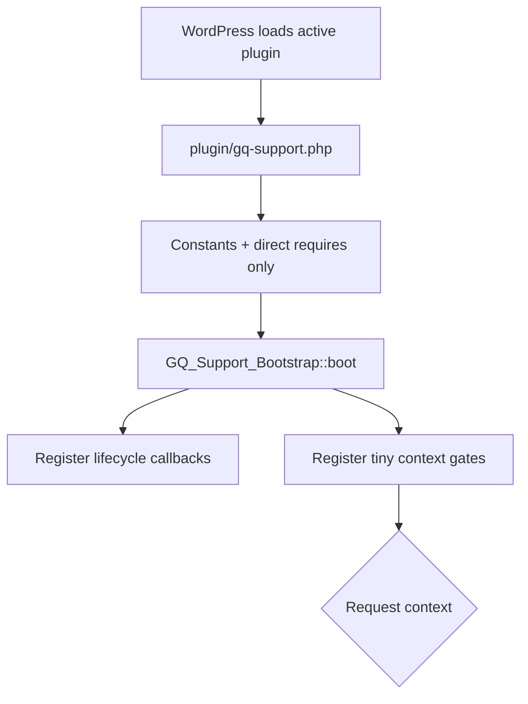
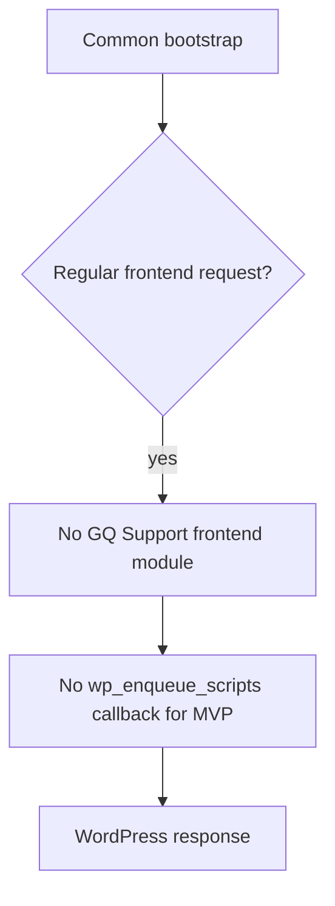
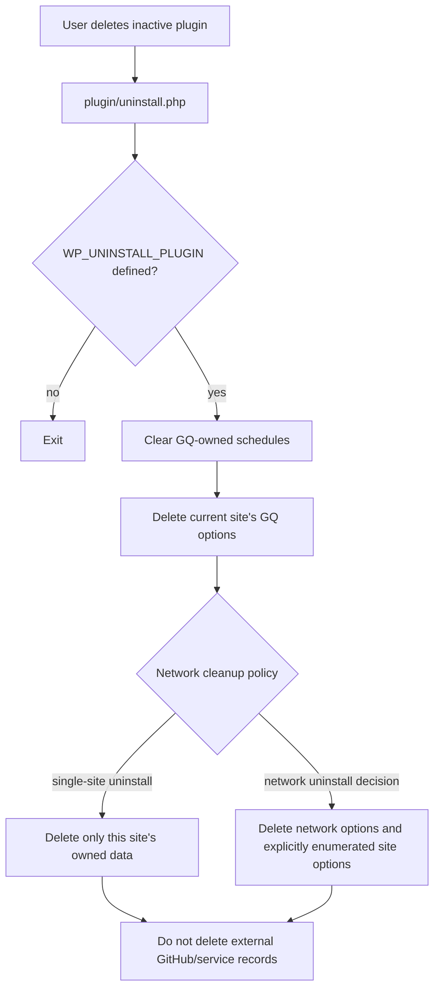

# WordPress bootstrap, hooks, and plugin lifecycle

- **Research target:** GitHub issue [#3](https://github.com/Quick-Release/gq-support/issues/3)
- **Status:** Fact-finding and design recommendation; no implementation decision is applied by this note
- **Access date:** 2026-09-18
- **Repository:** `Quick-Release/gq-support`

## Scope and inputs

This note uses the repository's domain vocabulary from [`CONTEXT.md`](../../CONTEXT.md): **Client**, **WordPress installation**, **Environment**, **Reporter**, **Support request**, **Message**, **Support repository**, **Visibility scope**, and **Delivery outcome**.

The accepted domain boundary is carried from [`docs/support-domain-design.md`](../support-domain-design.md) and ADRs 0001–0008: GitHub owns the client-visible conversation; WordPress owns local identity and capability context; the intake/delivery service owns routing, idempotency, receipts, attempts, and reconciliation; the widget is a projection. The existing WordPress/GitHub research note is also treated as prior design input: [`wordpress-github-support-widget.md`](wordpress-github-support-widget.md).

The checked-out repository does not contain copies of GitHub issue #2, #22, or #3. In this environment, the GitHub HTML and API URLs for those issues returned 404. Issue #2's accepted decisions are represented locally by `docs/support-domain-design.md` and ADRs 0001–0008. The existing WordPress/GitHub research note is the available local record of the earlier implementation discussion associated with this work. No claim about the unavailable issue comments is made here.

## Decision-shaped summary

### Recommendation

Use a **small, always-loadable PHP bootstrap** that only defines plugin constants, registers lifecycle callbacks, and registers lightweight context gates. Each gate loads its controller/service only when WordPress is serving that context:

- **Frontend:** no GQ Support assets, REST controllers, provider calls, cron work, or conversation state. The plugin is active but inert on a normal public request.
- **Admin:** a small launcher shell may be loaded for an eligible Reporter on supported site-admin screens. The full React/TanStack Query application is dynamically loaded only after opening the launcher. A dedicated page gets the full application only on its own screen.
- **REST:** routes are registered from `rest_api_init`; callbacks perform authentication, capability checks, and explicit Visibility scope checks. `is_admin()` is not used to decide whether REST routes exist or whether a Reporter is authorized.
- **Cron:** no plugin-owned scheduled work in the MVP. If later accepted, use one or more uniquely prefixed hooks, schedule once, and clear by the exact hook/argument tuple on deactivation.
- **WP-CLI:** load only a small command registration file when `defined( 'WP_CLI' ) && WP_CLI`; load the domain service inside command execution.
- **Activation/deactivation/uninstall:** register callbacks in the main plugin file, keep activation/deactivation local and fast, use versioned per-site migration markers, and make uninstall explicit and destructive only for plugin-owned WordPress data.

This preserves the existing decisions: no CPT, no local conversation table, no rewrite rules, no WooCommerce dependency, and no local WordPress job queue without a separately accepted decision ([`support-domain-design.md`](../support-domain-design.md), ADRs 0001, 0003, 0004, 0005, 0006, 0007, 0008).

### One important launcher consequence

A launcher on every supported WP-Admin screen and “do not load the whole app everywhere” are compatible only if the browser bundle is split:

1. `launcher.js` is a small, capability-agnostic UI shell that can render the button/root.
2. The click handler dynamically imports the full React application and query client.
3. The full app makes same-origin requests to the GQ Support REST routes.

This is a recommendation for implementation ticket #23, not a claim about the current scaffold. The current `plugin/app/src/main.tsx` creates the `QueryClient` at bundle startup, so it currently represents the full-app path rather than a split launcher.

## Source-backed facts versus recommendations

### Source-backed WordPress facts

- `is_admin()` determines whether the request is for an administrative interface; it does **not** determine whether the user is an administrator or authenticated. Capabilities are checked with `current_user_can()`. ([`is_admin()`](https://developer.wordpress.org/reference/functions/is_admin/), [`current_user_can()`](https://developer.wordpress.org/reference/functions/current_user_can/))
- `admin_enqueue_scripts` fires for admin-page asset enqueueing and provides the current admin page suffix specifically so scripts and styles can be restricted to the pages where they are used. ([`admin_enqueue_scripts`](https://developer.wordpress.org/reference/hooks/admin_enqueue_scripts/))
- `admin_footer` prints data before the default admin footer scripts, after the `wpfooter` element is closed. It is an admin-only output hook. ([`admin_footer`](https://developer.wordpress.org/reference/hooks/admin_footer/))
- `admin_menu` runs after the basic admin menu structure is in place and is the normal hook for adding menu/submenu entries. ([`admin_menu`](https://developer.wordpress.org/reference/hooks/admin_menu/))
- `add_submenu_page()` uses a capability to decide whether the entry is shown, but its page callback must check the capability again. ([`add_submenu_page()`](https://developer.wordpress.org/reference/functions/add_submenu_page/))
- `admin_bar_menu` receives a `WP_Admin_Bar` instance and can add, remove, or manipulate admin-bar nodes. ([`admin_bar_menu`](https://developer.wordpress.org/reference/hooks/admin_bar_menu/))
- `rest_api_init` fires while preparing a REST request; WordPress explicitly says endpoint objects should register there so they are loaded only when needed. ([`rest_api_init`](https://developer.wordpress.org/reference/hooks/rest_api_init/))
- Custom REST routes should be registered with `register_rest_route()` from `rest_api_init`, use a namespace, define argument validation/sanitization, and include a `permission_callback`. WordPress distinguishes authentication from authorization and recommends capability checks in the permission callback. ([Adding Custom Endpoints](https://developer.wordpress.org/rest-api/extending-the-rest-api/adding-custom-endpoints/))
- Cookie-authenticated REST requests use the logged-in WordPress cookie plus a `wp_rest` nonce, normally sent as `X-WP-Nonce`; without the nonce the request is treated as unauthenticated. The nonce does not replace the route's capability check. ([REST API Authentication](https://developer.wordpress.org/rest-api/using-the-rest-api/authentication/))
- `wp_is_rest_endpoint()` identifies a REST endpoint request, including a REST request dispatched internally from a regular page load. It is a request-context fact, not an authorization decision. ([`wp_is_rest_endpoint()`](https://developer.wordpress.org/reference/functions/wp_is_rest_endpoint/))
- `wp_doing_cron()` identifies a WordPress cron request. ([`wp_doing_cron()`](https://developer.wordpress.org/reference/functions/wp_doing_cron/))
- `wp_schedule_event()` schedules a recurring hook; duplicate prevention uses `wp_next_scheduled()`, and event arguments are part of event identity. WordPress warns that mismatched arguments can create duplicates and excessive growth of the `cron` option. ([`wp_schedule_event()`](https://developer.wordpress.org/reference/functions/wp_schedule_event/), [`wp_next_scheduled()`](https://developer.wordpress.org/reference/functions/wp_next_scheduled/))
- `wp_clear_scheduled_hook()` removes all events for a hook and its exact arguments. If a hook has multiple argument sets, each set must be cleared. ([`wp_clear_scheduled_hook()`](https://developer.wordpress.org/reference/functions/wp_clear_scheduled_hook/))
- Activation and deactivation hooks are distinct from uninstall. Activation is for setup; deactivation is for temporary data such as cache/temp files; uninstall is for permanent plugin-data deletion. ([Activation / Deactivation Hooks](https://developer.wordpress.org/plugins/plugin-basics/activation-deactivation-hooks/), [Uninstall Methods](https://developer.wordpress.org/plugins/plugin-basics/uninstall-methods/))
- `register_activation_hook()` and `register_deactivation_hook()` must be registered against the main plugin file. The activation/deactivation callbacks receive a multisite boolean indicating network-wide operation. ([`register_activation_hook()`](https://developer.wordpress.org/reference/functions/register_activation_hook/), [`register_deactivation_hook()`](https://developer.wordpress.org/reference/functions/register_deactivation_hook/), [`activate_{$plugin}`](https://developer.wordpress.org/reference/hooks/activate_plugin/), [`deactivate_{$plugin}`](https://developer.wordpress.org/reference/hooks/deactivate_plugin/))
- An activation hook does not run for a silently activated update. WordPress's plugin handbook therefore documents a separate version check for upgrades. ([`activate_{$plugin}`](https://developer.wordpress.org/reference/hooks/activate_plugin/), [Creating Tables with Plugins — version and upgrade sections](https://developer.wordpress.org/plugins/creating-tables-with-plugins/))
- `uninstall.php` is called from the plugin root when the user deletes the plugin and must guard execution with `WP_UNINSTALL_PLUGIN`. In multisite, looping over every site to delete options can be resource intensive. ([Uninstall Methods](https://developer.wordpress.org/plugins/plugin-basics/uninstall-methods/))
- Multisite has multiple sites with site-specific tables while the user table is shared. `get_option()` is site-local; `get_site_option()` is network-wide in multisite and falls back to `get_option()` on non-multisite. ([WordPress Multisite / Network](https://developer.wordpress.org/advanced-administration/multisite/), [`get_option()`](https://developer.wordpress.org/reference/functions/get_option/), [`get_site_option()`](https://developer.wordpress.org/reference/functions/get_site_option/))
- `get_current_blog_id()` identifies the current site and `get_current_network_id()` identifies the current network. ([`get_current_blog_id()`](https://developer.wordpress.org/reference/functions/get_current_blog_id/), [`get_current_network_id()`](https://developer.wordpress.org/reference/functions/get_current_network_id/))
- `wp_initialize_site` runs a site's initialization routine and `wp_delete_site` fires once a site has been deleted from the database. ([`wp_initialize_site`](https://developer.wordpress.org/reference/hooks/wp_initialize_site/), [`wp_delete_site`](https://developer.wordpress.org/reference/hooks/wp_delete_site/))
- `add_option()` can explicitly control autoloading; WordPress recommends not autoloading options used only on a few specific URLs. ([`add_option()`](https://developer.wordpress.org/reference/functions/add_option/))
- WordPress plugins should prefix globally accessible names, including functions, classes, namespaces, options, and transients. The plugin's existing PHPCS configuration uses `GQ_Support`, `GQ_SUPPORT`, and `gq_support` prefixes. ([Plugin Best Practices](https://developer.wordpress.org/plugins/plugin-basics/best-practices/), [`plugin/.phpcs.xml.dist`](../../plugin/.phpcs.xml.dist))
- `apply_filters()` passes a value through registered callbacks and can pass additional arguments; `do_action()` invokes registered callbacks and can pass additional arguments. ([`apply_filters()`](https://developer.wordpress.org/reference/functions/apply_filters/), [`do_action()`](https://developer.wordpress.org/reference/functions/do_action/))
- WP-CLI's official handbook documents conditional loading of plugin command files using `defined( 'WP_CLI' ) && WP_CLI` and registration with `WP_CLI::add_command()`. ([WP-CLI Commands Cookbook](https://make.wordpress.org/cli/handbook/guides/commands-cookbook/))

### Recommendations for GQ Support

The following are design recommendations derived from those facts and from the accepted repository decisions. They are not WordPress requirements.

- Keep the main plugin file to constants, one-time `require_once` calls, lifecycle registration, and `GQ_Support_Bootstrap::boot()`. Do not instantiate the React app, REST controllers, HTTP client, GitHub adapter, or migration runner from the main file.
- Treat context detection and authorization as different layers. Context chooses what code may be loaded; authorization is re-evaluated at the action boundary using the current Reporter and explicit Visibility scope.
- Make `gq_support/v1` the REST namespace and keep provider/repository identifiers out of browser configuration and request parameters.
- Keep all WordPress-side persistent data to small site/network options and operational references. Do not introduce a CPT, local conversation table, rewrite rules, WooCommerce integration, or a WordPress outbox/job queue for this slice.

## Proposed initialization diagrams

The diagrams show the intended code path. A dashed box means “only loaded or executed in that context.”

### Common bootstrap: every request



No common path performs a provider HTTP request, creates a conversation record, loads the full React bundle, or instantiates the GitHub/Worker client.

### Frontend/public request



If a future public surface is accepted, its assets belong on `wp_enqueue_scripts`, the native frontend enqueue hook. ([`wp_enqueue_scripts`](https://developer.wordpress.org/reference/hooks/wp_enqueue_scripts/))

### WP-Admin floating launcher

```mermaid
flowchart TD
    A[Common bootstrap] --> B[admin_enqueue_scripts($hook_suffix)]
    B --> C{Site-admin screen + eligible Reporter + supported screen?}
    C -->|no| D[No GQ asset]
    C -->|yes| E[Load small launcher.js only]
    E --> F[admin_footer]
    F --> G[Print one root + non-secret bootstrap data]
    G --> H{Reporter opens launcher}
    H -->|yes| I[Dynamic import full React app]
    I --> J[Same-origin REST requests]
    H -->|no| K[No full app initialization]
```

The capability check controls whether the launcher is offered. REST permission callbacks remain authoritative for reads and mutations.

### Dedicated admin page

```mermaid
flowchart TD
    A[Common bootstrap] --> B[admin_menu]
    B --> C[add_submenu_page(..., gq-support)]
    C --> D[WordPress returns page hook suffix]
    D --> E[admin_enqueue_scripts]
    E --> F{Current suffix is GQ page?}
    F -->|yes| G[Enqueue full app assets for this page only]
    F -->|no| H[No full app assets]
    C --> I[Page callback]
    I --> J[Re-check capability + render app root]
```

### REST request

```mermaid
flowchart TD
    A[Common bootstrap] --> B[rest_api_init]
    B --> C[Load route registrar]
    C --> D[register_rest_route(gq_support/v1/...)]
    D --> E[Cookie + wp_rest nonce authentication]
    E --> F[permission_callback]
    F --> G{Capability + explicit Visibility scope}
    G -->|deny| H[401/403 WP_Error]
    G -->|allow| I[Validate and sanitize request arguments]
    I --> J[Load domain service + Worker client lazily]
    J --> K[Revalidate Reporter, installation, mapping, payload]
    K --> L[Return WP_REST_Response / WP_Error]
```

### WP-Cron request

```mermaid
flowchart TD
    A[Common bootstrap] --> B{wp_doing_cron()}
    B -->|no| C[No cron module]
    B -->|yes| D{Plugin-owned hook exists?}
    D -->|no| E[No GQ work]
    D -->|yes, only if later accepted| F[Load cron callback]
    F --> G[Run bounded plugin-owned maintenance]
    G --> H[No client-visible conversation authority]
```

The MVP deliberately has no plugin-owned scheduled hook. Worker delivery and reconciliation remain external operational concerns unless a later ADR accepts a WordPress scheduling role.

### WP-CLI request

```mermaid
flowchart TD
    A[Common bootstrap] --> B{defined(WP_CLI) && WP_CLI?}
    B -->|no| C[No CLI module]
    B -->|yes| D[Load CLI command registrar]
    D --> E[WP_CLI::add_command]
    E --> F[Command invocation]
    F --> G[Load migration/context/domain service]
    G --> H[Explicit command capability/scope policy]
```

WP-CLI is an operator boundary, not a Reporter-facing REST boundary. Commands must not silently reuse browser claims or bypass repository mapping.

### Activation

```mermaid
flowchart TD
    A[Main plugin file included by activation] --> B[register_activation_hook(__FILE__, callback)]
    B --> C[callback($network_wide)]
    C --> D{Network-wide?}
    D -->|no| E[Initialize current site's small marker]
    D -->|yes| F[Initialize network marker only]
    E --> G[No remote call, CPT, table, rewrite flush, or queue]
    F --> G
```

The per-site identity is created on the site where the plugin is active/first initialized; network activation must not assign one shared identity to all sites.

### Deactivation

```mermaid
flowchart TD
    A[Main plugin file] --> B[register_deactivation_hook(__FILE__, callback)]
    B --> C[callback($network_deactivating)]
    C --> D[Clear every GQ-owned scheduled hook + exact args]
    D --> E[Remove temporary runtime state only]
    E --> F[Retain configuration and identity]
    F --> G[No GitHub conversation deletion]
```

Deactivation is reversible. It must not delete the Support repository, Support requests, Messages, or delivery history owned by the service.

### Uninstall



## Hook-to-responsibility matrix

| Hook/API | Context and timing | Responsibility | Lazy boundary and authorization | Choice |
|---|---|---|---|---|
| Main plugin file | Active plugin load; all contexts | Define constants, require bootstrap, register activation/deactivation, call bootstrap | No provider client, React, route controller, or conversation state | **Use.** WordPress requires lifecycle hooks to be registered against the main file. |
| `init` | General WordPress load, authenticated user is available | No broad GQ initialization in MVP; reserve for a future domain registration that truly needs all requests | A generic `init` callback would run across frontend/admin/REST/cron; do not use it to load the app | **Avoid as a catch-all.** `init` is broad and runs before headers. ([`init`](https://developer.wordpress.org/reference/hooks/init/)) |
| `wp_enqueue_scripts` | Frontend asset enqueue phase | No-op for current admin-only product; future public UI only if separately accepted | Never enqueue the support app on public pages for the current scope | **Reserve.** It is the native frontend asset hook. ([`wp_enqueue_scripts`](https://developer.wordpress.org/reference/hooks/wp_enqueue_scripts/)) |
| `admin_enqueue_scripts($hook_suffix)` | Admin asset enqueue phase | Enqueue launcher shell on supported site-admin screens; enqueue full app only on the dedicated page | Check site-admin versus network-admin, current screen, Reporter eligibility, asset existence; use returned dedicated-page suffix | **Primary launcher hook.** WordPress explicitly recommends it for restricting admin assets. ([`admin_enqueue_scripts`](https://developer.wordpress.org/reference/hooks/admin_enqueue_scripts/)) |
| `admin_footer($data)` | End of normal admin page output | Print one mount root and non-secret bootstrap data for the launcher | Output only when the same screen/actor gate is true; it does not authorize REST actions | **Use for root, not asset loading.** ([`admin_footer`](https://developer.wordpress.org/reference/hooks/admin_footer/)) |
| `admin_menu` | Admin menu construction | Register one optional GQ Support submenu under an existing top-level menu | Menu capability is a visibility hint; page callback rechecks capability and scope | **Use for dedicated page.** ([`admin_menu`](https://developer.wordpress.org/reference/hooks/admin_menu/), [`add_submenu_page()`](https://developer.wordpress.org/reference/functions/add_submenu_page/)) |
| `network_admin_menu` | Network admin menu construction | Optional network configuration/diagnostic page only, if later accepted | Never treat network administrator status as Reporter support scope; no floating client launcher in network admin | **Separate from site-admin.** ([`add_submenu_page()`](https://developer.wordpress.org/reference/functions/add_submenu_page/)) |
| `admin_bar_menu($wp_admin_bar)` | Admin bar node construction | Optional “Open Support” node linking to the launcher/dedicated page | Node is only a navigation affordance; it does not replace the root/assets or authorization checks | **Optional fallback, not primary.** ([`admin_bar_menu`](https://developer.wordpress.org/reference/hooks/admin_bar_menu/)) |
| `rest_api_init($wp_rest_server)` | REST server preparation | Register `gq_support/v1` routes and only then load route/controller definitions | Each route has a `permission_callback`; callbacks re-check the current Reporter, installation mapping, and Visibility scope | **Required.** Do not condition registration on `is_admin()`. ([`rest_api_init`](https://developer.wordpress.org/reference/hooks/rest_api_init/), [Adding Custom Endpoints](https://developer.wordpress.org/rest-api/extending-the-rest-api/adding-custom-endpoints/)) |
| `admin_init` | Admin screen, `admin-ajax.php`, and `admin-post.php` initialization | Optional maintenance/migration check for admin-only work; no REST registration | Do not assume it means a normal screen; it also runs on admin endpoints | **Narrow use only.** ([`admin_init`](https://developer.wordpress.org/reference/hooks/admin_init/)) |
| `wp_doing_cron()` / plugin-owned cron action | WP-Cron execution | No action in MVP; later bounded maintenance only | Schedule once with stable args; clear exact hook/args on deactivation/uninstall; never turn this into a local delivery queue | **No MVP cron.** ([`wp_doing_cron()`](https://developer.wordpress.org/reference/functions/wp_doing_cron/), [`wp_schedule_event()`](https://developer.wordpress.org/reference/functions/wp_schedule_event/), [`wp_clear_scheduled_hook()`](https://developer.wordpress.org/reference/functions/wp_clear_scheduled_hook/)) |
| `defined('WP_CLI') && WP_CLI` / `WP_CLI::add_command()` | WP-CLI bootstrap and command registration | Register operator commands; load implementation on command execution | Command code must use server-side installation/mapping context and explicit operator policy | **Use for CLI only.** ([WP-CLI Commands Cookbook](https://make.wordpress.org/cli/handbook/guides/commands-cookbook/)) |
| `register_activation_hook(__FILE__, ...)` | Explicit plugin activation | Write only minimal local/network markers and prepare reversible local setup | Receives `$network_wide`; no remote call and no network-wide loop over all sites | **Use.** ([`register_activation_hook()`](https://developer.wordpress.org/reference/functions/register_activation_hook/)) |
| `register_deactivation_hook(__FILE__, ...)` | Explicit plugin deactivation | Clear plugin-owned schedules and temporary state; retain identity/configuration | Receives `$network_deactivating`; no conversation/service deletion | **Use.** ([`register_deactivation_hook()`](https://developer.wordpress.org/reference/functions/register_deactivation_hook/)) |
| `uninstall.php` + `WP_UNINSTALL_PLUGIN` | Explicit plugin deletion after deactivation | Delete only plugin-owned WordPress options/schedules, with a documented multisite policy | Never delete GitHub Support requests, Messages, Support repository, or service operational records from this local hook | **Use existing file.** ([Uninstall Methods](https://developer.wordpress.org/plugins/plugin-basics/uninstall-methods/)) |
| `wp_initialize_site` / `wp_delete_site` | Multisite site creation/deletion | Initialize or retire per-site identity/markers when network activation policy requires it | Must not share a Client identity merely because sites share a network; external mapping cleanup requires service/operator policy | **Use for multisite hooks when needed.** ([`wp_initialize_site`](https://developer.wordpress.org/reference/hooks/wp_initialize_site/), [`wp_delete_site`](https://developer.wordpress.org/reference/hooks/wp_delete_site/)) |

## Admin entry-point comparison and launcher choice

| Entry point | What it is good at | Limits for this product | Recommendation |
|---|---|---|---|
| `admin_enqueue_scripts` | Native asset enqueue point for admin pages; receives `$hook_suffix`, allowing page gating. ([official reference](https://developer.wordpress.org/reference/hooks/admin_enqueue_scripts/)) | It does not render a root and its callback can run on every admin page, so it must remain a cheap gate. | **Primary asset hook.** Enqueue a small launcher shell on supported site-admin screens. Use the exact suffix returned by `add_submenu_page()` for full app assets on the dedicated page. |
| `admin_footer` | A predictable place to echo the mount element/data near the end of normal admin markup. ([official reference](https://developer.wordpress.org/reference/hooks/admin_footer/)) | It is output, not authorization or asset management; unusual admin rendering contexts need explicit testing. | **Root only.** Use it after the same eligibility check as enqueueing. |
| `admin_menu` + `add_submenu_page` | Native dedicated page registration; capability controls menu visibility and WordPress returns a page hook suffix. ([`admin_menu`](https://developer.wordpress.org/reference/hooks/admin_menu/), [`add_submenu_page`](https://developer.wordpress.org/reference/functions/add_submenu_page/)) | It does not make a floating launcher appear on other pages; callback capability checks are still required. | **Dedicated page.** Add one page under Settings or Tools, not a top-level menu, unless later product research justifies a top-level destination. |
| `admin_bar_menu` | Native way to add a toolbar node to admin-bar items. ([official reference](https://developer.wordpress.org/reference/hooks/admin_bar_menu/)) | The admin bar may be hidden or unavailable, and it is navigation rather than a reliable floating surface. | **Optional secondary affordance.** Link to the dedicated page or set a launcher-open intent; do not depend on it for universal availability. |

### Supported WP-Admin screen policy

The MVP should define “supported WP-Admin pages” as normal **site-admin** screens where WordPress runs the normal admin header/footer lifecycle: Dashboard, posts/pages and their editors, Media, Comments, Appearance, Plugins, Users, Tools, Settings, and plugin screens, including block-editor admin screens. The launcher gate should exclude network-admin screens, login, `admin-ajax.php`, `admin-post.php`, and any screen where a root cannot be safely rendered. This is a product recommendation; it must be verified by an automated/manual matrix before #23 is called complete.

The full app must not be loaded on all of those screens. The launcher shell is the compromise: small, no provider access, and no query client until click. The dedicated page is the exception and may load the full app directly.

## REST routes, request context, and authorization

### Route registration

Register these routes inside a callback on `rest_api_init`, not inside `is_admin()`:

```text
GET  /gq-support/v1/requests
GET  /gq-support/v1/requests/{requestId}
POST /gq-support/v1/requests
POST /gq-support/v1/requests/{requestId}/messages
POST /gq-support/v1/requests/{requestId}/state
```

The WordPress REST handbook says route registration belongs on `rest_api_init` and that the endpoint's `permission_callback` is where authorization belongs. ([Adding Custom Endpoints](https://developer.wordpress.org/rest-api/extending-the-rest-api/adding-custom-endpoints/), [`rest_api_init`](https://developer.wordpress.org/reference/hooks/rest_api_init/))

### Context versus authorization

- **Context:** `is_admin()`, `wp_doing_cron()`, `defined( 'WP_CLI' ) && WP_CLI`, and REST lifecycle hooks answer “what kind of execution is this?” `is_admin()` specifically does not answer “is this user an administrator?” ([`is_admin()`](https://developer.wordpress.org/reference/functions/is_admin/)).
- **Authentication:** the logged-in WordPress cookie plus a `wp_rest` nonce establishes the local REST user for same-origin dashboard requests. ([REST API Authentication](https://developer.wordpress.org/rest-api/using-the-rest-api/authentication/))
- **Authorization:** each route checks the plugin capability and the domain's explicit Visibility scope. Reporter, WordPress installation, Environment, Support request, and repository mapping are resolved server-side.
- **Revalidation:** route arguments are sanitized/validated at registration and the callback revalidates object scope before reading or mutating. Any extension filter is followed by the same revalidation.

A nonce is not a service credential, GitHub credential, or substitute for `current_user_can()`. The WordPress callback should forward a server-authenticated intent to the Worker; browser data must never choose a Client, Support repository, GitHub issue, or installation mapping.

## Lifecycle, migrations, scheduled work, and multisite

### Activation and first initialization

**Activation callback:** register it directly from `plugin/gq-support.php` against `__FILE__`. Accept `$network_wide`. On single-site activation, initialize a small site-local marker. On network activation, initialize only network-level state and let each site initialize its own marker lazily; do not loop through every site in the activation request.

Suggested local keys, all prefixed and non-autoloaded unless measured otherwise:

```text
gq_support_schema_version       site-local migration marker
gq_support_installation_id      opaque per-site WordPress-installation identity
gq_support_environment          operator/configured environment, if stored locally
gq_support_network_version     network-level marker, multisite only
```

The opaque `gq_support_installation_id` identifies the **WordPress installation/site boundary**, not the Client. In multisite, each site gets a distinct ID. The service mapping may map multiple site identities to one Client's Support repository by default, as ADR 0008 requires; a separate repository is an explicit isolation exception. `get_current_blog_id()` and `get_current_network_id()` are useful local coordinates, but the service-facing identity should not be a raw, user-editable browser claim. ([`get_current_blog_id()`](https://developer.wordpress.org/reference/functions/get_current_blog_id/), [`get_current_network_id()`](https://developer.wordpress.org/reference/functions/get_current_network_id/), [`get_option()`](https://developer.wordpress.org/reference/functions/get_option/), [`get_site_option()`](https://developer.wordpress.org/reference/functions/get_site_option/))

### Versioned migrations

Use a monotonic schema version, separate from the display/plugin version if their meanings diverge. WordPress documents storing a version option and running a version comparison because activation is not called for silent updates. ([Creating Tables with Plugins](https://developer.wordpress.org/plugins/creating-tables-with-plugins/))

Recommended migration runner:

1. Read the site-local schema version only when a GQ context needs plugin state.
2. Run ordered, idempotent migrations from the stored version to the code version.
3. Persist the new version only after each migration succeeds.
4. Use a network marker for network-owned settings and site markers for site-owned settings.
5. Do not call a provider, create a Support request, or alter repository mapping from a migration.
6. Run the runner from the relevant admin/REST/CLI/cron boundary, not on every public frontend request.

If a future migration needs every site in a network, expose an explicit WP-CLI/admin operation with progress and resumability rather than doing an unbounded loop in activation or a public request.

### Deactivation and uninstall ownership

| Data/work | Owner | Deactivation | Uninstall |
|---|---|---|---|
| Launcher/full-app assets | Plugin package | No action | Files are removed by plugin deletion |
| Site-local identity and configuration | WordPress installation/plugin | Retain for reversible reactivation | Delete only if the deletion policy explicitly says local configuration is disposable |
| Network-level configuration | Network/plugin | Retain on network deactivation | Delete only on an explicit network uninstall policy |
| WP-Cron events | Plugin | Clear every GQ-owned hook with exact args | Clear again defensively |
| Support request and Message conversation | GitHub Support repository | Never delete | Never delete from `uninstall.php` |
| Delivery receipts, attempts, reconciliation state | Intake/delivery service | Service-owned retention policy; local uninstall cannot assume authority | Service deletion/erasure requires a separate authenticated service operation |
| React/TanStack Query cache | Browser | No durable ownership | No server cleanup |

The current MVP has no WP-Cron event and no local outbox. If a later design introduces a plugin-owned maintenance event, use a stable hook such as `gq_support_reconcile` and stable argument identity, call `wp_next_scheduled()` before scheduling, and clear it with `wp_clear_scheduled_hook()` on deactivation. WordPress requires exact event arguments for clearing. ([`wp_schedule_event()`](https://developer.wordpress.org/reference/functions/wp_schedule_event/), [`wp_clear_scheduled_hook()`](https://developer.wordpress.org/reference/functions/wp_clear_scheduled_hook/))

### New and deleted multisite sites

If the plugin is network-active and site-local initialization is required, use `wp_initialize_site` to create the new site's local marker without assigning a shared network identity. On deletion, use `wp_delete_site` to retire local references if the data is still available; it must not trigger deletion of GitHub conversation records. ([`wp_initialize_site`](https://developer.wordpress.org/reference/hooks/wp_initialize_site/), [`wp_delete_site`](https://developer.wordpress.org/reference/hooks/wp_delete_site/))

Avoid an uninstall loop over all sites by default: WordPress explicitly warns that such a multisite loop can be resource intensive. A network-wide purge, if ever required, should be a separate, resumable operator action with a clear retention decision. ([Uninstall Methods](https://developer.wordpress.org/plugins/plugin-basics/uninstall-methods/))

## Extension points

These are proposed public contracts. They are recommendations, not implementation requirements until the hook names, argument order, return values, and compatibility policy are accepted.

All hook names use the `gq_support_` prefix. The `apply_filters()` contracts return the first value after all callbacks; the `do_action()` contracts are notifications/extension points with explicit arguments. ([`apply_filters()`](https://developer.wordpress.org/reference/functions/apply_filters/), [`do_action()`](https://developer.wordpress.org/reference/functions/do_action/))

| Hook | Type/timing | Signature contract | Trusted boundary and revalidation |
|---|---|---|---|
| `gq_support_admin_launcher_enabled` | Filter immediately before admin asset/root decision | `apply_filters( 'gq_support_admin_launcher_enabled', bool $enabled, WP_Screen $screen, array $actor_context )` | Server-side PHP extensions are trusted to alter presentation. The result cannot grant REST permission; the final gate still requires logged-in user, plugin capability, site-admin screen, and supported screen policy. |
| `gq_support_admin_bootstrap` | Filter immediately before JSON encoding data for the launcher | `apply_filters( 'gq_support_admin_bootstrap', array $bootstrap, array $actor_context, WP_Screen $screen )` | Only non-secret presentation data is allowed: REST URL, nonce, opaque installation ID, and UI hints. Strip/reject tokens, repository data, raw cookies, and unvalidated personal data; validate the final schema after filtering. |
| `gq_support_rest_request` | Filter after route argument validation and before domain forwarding | `apply_filters( 'gq_support_rest_request', array $intent, WP_REST_Request $request, array $actor_context )` | Input remains untrusted despite a PHP extension filter. Re-run size, plain-text, idempotency, installation-binding, object-scope, and allowlist checks after filtering. Never let this change Reporter identity or Support repository mapping. |
| `gq_support_before_delivery` | Action after authorization and final validation, immediately before the WordPress-to-Worker call | `do_action( 'gq_support_before_delivery', array $intent, array $actor_context )` | Trusted server-side observers/integrators may add telemetry or veto through a defined exception/error policy, but no callback can claim `delivered`, bypass scope, or inject a credential. The Worker independently authenticates and revalidates. |
| `gq_support_delivery_result` | Action after the Worker response has been translated to the stable domain outcome | `do_action( 'gq_support_delivery_result', array $result, array $intent_context )` | Observation only by default. Do not pass secrets or raw provider bodies. The action cannot rewrite `Delivery outcome` or `Support status`; any displayed result is the sanitized translated result. |
| `gq_support_rest_response` | Filter immediately before returning a response to the browser | `apply_filters( 'gq_support_rest_response', array $response, WP_REST_Request $request, array $actor_context )` | Revalidate response schema and visibility after filtering. Never permit a callback to add another Reporter’s Message, provider token, internal labels, or repository credentials. |

### Extension-point policy

1. Document hook priority expectations, argument count, return type, and when the hook was introduced.
2. Treat hook names/signatures as public API; deprecate rather than silently changing them.
3. Keep actions after authorization where possible. Never place a hook that can turn an unauthorized request into an authorized one.
4. Revalidate after every filter that can alter data crossing into REST, the Worker, or the browser.
5. Prefer an allowlisted value object/array over passing mutable service objects.
6. Do not expose GitHub App keys, installation tokens, Worker signing secrets, cookies, nonces intended only for internal use, or raw provider responses.

## Proposed module structure extending the scaffold

The existing scaffold has `plugin/gq-support.php`, `plugin/includes/class-gq-support-plugin.php`, `plugin/uninstall.php`, a React app, and a placeholder Worker. The following structure keeps WordPress adapters shallow and keeps the domain/service boundary visible:

```text
plugin/
  gq-support.php                         # header, constants, lifecycle registration, boot
  uninstall.php                           # guarded local cleanup only
  includes/
    class-gq-support-bootstrap.php        # tiny context gates; no heavy service construction
    class-gq-support-context.php           # request facts, screen/context helpers
    class-gq-support-lifecycle.php         # activation/deactivation/uninstall helpers
    class-gq-support-migrations.php       # ordered site/network version runner
    class-gq-support-installation.php     # per-site identity/environment resolution
    class-gq-support-authorization.php    # capability + Visibility scope checks
    admin/
      class-gq-support-admin.php          # admin hooks, launcher, page registration
      class-gq-support-admin-assets.php   # launcher/full-app asset decisions
    rest/
      class-gq-support-rest.php           # rest_api_init route registrar
      class-gq-support-rest-controller.php# schemas, permission callbacks, response mapping
    cron/
      class-gq-support-cron.php           # absent/no-op until separately accepted
    cli/
      class-gq-support-cli.php            # WP_CLI command registrar
    service/
      class-gq-support-worker-client.php  # WP HTTP API adapter; no browser secret
      class-gq-support-support-service.php# WordPress-to-Worker intent boundary
```

### Notes on the current PHP class

`class-gq-support-plugin.php` currently constructs a singleton and registers `admin_enqueue_scripts` and `admin_footer`, with `edit_others_posts` as a scaffold capability. The implementation should either evolve that class into the tiny bootstrap or replace it with a prefixed bootstrap plus context modules. It should not become a god object containing admin rendering, REST, lifecycle, migrations, authorization, and the Worker client.

The current `plugin/composer.json` has development dependencies but no autoload section. For the first implementation, explicit `require_once` files are the lowest-risk extension of the scaffold. A later PSR-4 autoload decision is possible, but it should not make activation/uninstall or the main bootstrap depend on loading the whole application.

### React boundary

```text
launcher.js
  - finds #gq-support-root
  - renders open button and loading/error shell
  - loads full-app.js on user intent

full-app.js
  - QueryClientProvider
  - request-list/detail projection
  - create/reply/close/reopen mutations
  - manual refresh
```

The browser receives only a non-secret bootstrap object. It never receives GitHub credentials, a Worker service secret, repository selection, or an authorization claim that the REST route does not independently enforce. This follows the existing WordPress/GitHub research note and ADRs 0002–0004.

## Public-request performance constraints and measurement plan

No benchmark was run for this research note. The following are **proposed acceptance constraints**, to be measured on a production-like WordPress installation before merging the bootstrap/launcher work.

### Hard constraints for ordinary public frontend requests

- **0 GQ Support SQL queries** on anonymous and ordinary frontend requests.
- **0 GQ Support remote HTTP requests.**
- **0 GQ Support frontend assets.** The current MVP is admin-only.
- **0 full React/TanStack Query initialization.**
- **0 scheduled delivery or reconciliation work.**
- **No large autoloaded plugin option.** Site/network identity and configuration are accessed only in relevant contexts and should be created with autoload disabled where they are not needed on most requests. WordPress documents that rarely used options should not be autoloaded. ([`add_option()`](https://developer.wordpress.org/reference/functions/add_option/))
- **Target regression:** median server wall-time delta no greater than 1% and p95 delta no greater than 5 ms versus the same site with the plugin inactive, measured over at least 100 warm requests per case. These are project budgets, not WordPress guarantees.

The zero-query/zero-HTTP constraints are preferable to a fragile microsecond promise: they make the public-request ownership boundary observable and directly enforce the requirement that the support widget is not a public frontend feature.

### Admin and route budgets

- Launcher path: no provider call, no Worker call, and no full app bundle initialization before click.
- Dedicated page: full app is allowed only when its page hook suffix is active.
- REST route registration: no provider call merely because `rest_api_init` fired; provider calls occur only in an authorized route callback.
- Migration: no unbounded network-site loop in a request; a network operation must be resumable.

### Measurement cases

Run the same cases with the plugin inactive and active:

1. Anonymous frontend page.
2. Logged-in frontend page.
3. Logged-in site-admin Dashboard.
4. Logged-in site-admin post editor/block editor.
5. Logged-in network-admin page (must not receive the site launcher).
6. Dedicated GQ Support page.
7. REST `GET` denied, REST `GET` allowed, and REST mutation.
8. WP-CLI command with and without the plugin command.
9. WP-Cron with no GQ event and, only if later added, the GQ event.

Record PHP wall time, memory, database query count/time, outbound HTTP count, response size, and emitted asset bytes. Add a regression test that fails if a normal frontend request enqueues GQ assets or makes a GQ HTTP/DB call. WordPress documents `wp profile` as a WP-CLI command for identifying slow WordPress behavior, which may be useful for the measurement harness. ([WP-CLI command list](https://developer.wordpress.org/cli/commands/), [`wp profile`](https://developer.wordpress.org/cli/commands/profile/))

## Ownership and cleanup rules

- **WordPress owns:** current user, local capabilities, current site/network context, per-site WordPress-installation identity, local environment configuration, and the decision to display a launcher.
- **The operator-controlled mapping owns:** Client-to-installation-to-Support-repository routing. A Reporter cannot choose it.
- **The intake/delivery service owns:** delivery intents, idempotency, ordered sequences, receipts, attempts, reconciliation, and provider identity. These are operational records, not a competing conversation record.
- **GitHub owns:** the Support request, client-visible Message comments, support status, and client-visible classification in the dedicated private Support repository.
- **The plugin owns:** its PHP/React files, prefixed options, prefixed hooks, and any explicitly accepted scheduled maintenance hooks.
- **The plugin does not own:** GitHub Support requests, GitHub Messages, the Support repository, or service-side delivery records. Deactivation and uninstall must not delete them.
- **No CPT, local conversation table, rewrite rules, WooCommerce dependency, or local job queue** is introduced by this bootstrap design. Any exception requires a new accepted decision and an ownership/retention/reconciliation plan.

## Small implementation breakdown for #23 and follow-on work

1. **Bootstrap and context gate**
   - Keep `gq-support.php` minimal.
   - Register activation/deactivation immediately against the main file.
   - Add explicit context helpers; do not use `is_admin()` as authorization.

2. **Admin launcher shell**
   - Add `admin_enqueue_scripts` screen/actor gate.
   - Split launcher shell from full React app.
   - Use `admin_footer` for one root and a small JSON bootstrap.
   - Exercise every supported site-admin screen and network-admin exclusion.

3. **Dedicated page**
   - Register one submenu from `admin_menu`.
   - Save the returned page hook suffix for asset gating.
   - Re-check capability in the page callback.

4. **REST boundary**
   - Register `gq_support/v1` from `rest_api_init`.
   - Implement schemas and `permission_callback`s.
   - Separate WordPress cookie/nonce authentication, capability authorization, and explicit Visibility scope.
   - Keep Worker forwarding server-side and translate errors/outcomes to the accepted contract.

5. **Identity and migrations**
   - Add non-autoloaded site-local schema/installation markers and optional network marker.
   - Add ordered migration runner for activation, upgrades, REST, CLI, and any future cron path.
   - Define new-site/deleted-site multisite behavior.

6. **Lifecycle and cleanup**
   - Implement guarded `uninstall.php` cleanup for only known local keys.
   - Add schedule cleanup helpers even though the MVP schedules nothing.
   - Test single-site activation, site deactivation, network activation/deactivation, site creation, site deletion, reinstall, update, and uninstall.

7. **CLI and cron seams**
   - Add a conditional CLI registrar only if an operator command is needed.
   - Leave cron absent until an accepted requirement exists; if added, test duplicate prevention and exact-argument cleanup.

8. **Extension contracts and tests**
   - Add only the hooks in this note that have a consumer.
   - Test filter tampering/revalidation, forbidden scope, response redaction, and no secret leakage.

## Open decisions before implementation is considered complete

- Exact plugin capabilities (`gq_support_submit`, read/reply/state capabilities) and how they map to explicit Visibility scopes.
- The supported-screen allowlist versus “all normal site-admin screens,” especially Customizer/iframe and unusual plugin screens.
- Whether the dedicated page is needed in the first launcher ticket or follows the floating launcher.
- The final browser bundle-size budget and whether Vite's dynamic import output is acceptable for the supported WordPress/browser matrix.
- Whether per-site identity is generated locally, provisioned by onboarding, or bound to a service-issued installation record.
- Network-admin configuration surface and network/site option ownership.
- The Worker authentication/replay contract, which remains an open decision in the existing research note.
- Whether any WordPress cron maintenance is needed at all; delivery should remain external unless a new decision says otherwise.
- Hook API stability/versioning and the first real extension consumer.
- Privacy/retention/erasure policy for any local configuration or transient operational payloads.

## Sources

All external sources below are official WordPress Developer Resources, the official WordPress Plugin Handbook, official WordPress core references/source links, or the official WP-CLI handbook. Accessed **2026-09-18**.

### WordPress plugin and lifecycle

- [Plugin Best Practices](https://developer.wordpress.org/plugins/plugin-basics/best-practices/)
- [Activation / Deactivation Hooks](https://developer.wordpress.org/plugins/plugin-basics/activation-deactivation-hooks/)
- [Uninstall Methods](https://developer.wordpress.org/plugins/plugin-basics/uninstall-methods/)
- [Creating Tables with Plugins](https://developer.wordpress.org/plugins/creating-tables-with-plugins/)
- [`register_activation_hook()`](https://developer.wordpress.org/reference/functions/register_activation_hook/)
- [`register_deactivation_hook()`](https://developer.wordpress.org/reference/functions/register_deactivation_hook/)
- [`register_uninstall_hook()`](https://developer.wordpress.org/reference/functions/register_uninstall_hook/)
- [`activate_{$plugin}`](https://developer.wordpress.org/reference/hooks/activate_plugin/)
- [`deactivate_{$plugin}`](https://developer.wordpress.org/reference/hooks/deactivate_plugin/)

### WordPress request and admin hooks

- [`is_admin()`](https://developer.wordpress.org/reference/functions/is_admin/)
- [`init`](https://developer.wordpress.org/reference/hooks/init/)
- [`admin_init`](https://developer.wordpress.org/reference/hooks/admin_init/)
- [`wp_enqueue_scripts`](https://developer.wordpress.org/reference/hooks/wp_enqueue_scripts/)
- [`admin_enqueue_scripts`](https://developer.wordpress.org/reference/hooks/admin_enqueue_scripts/)
- [`admin_footer`](https://developer.wordpress.org/reference/hooks/admin_footer/)
- [`admin_menu`](https://developer.wordpress.org/reference/hooks/admin_menu/)
- [`add_submenu_page()`](https://developer.wordpress.org/reference/functions/add_submenu_page/)
- [`admin_bar_menu`](https://developer.wordpress.org/reference/hooks/admin_bar_menu/)

### WordPress REST and authentication

- [`rest_api_init`](https://developer.wordpress.org/reference/hooks/rest_api_init/)
- [Adding Custom Endpoints](https://developer.wordpress.org/rest-api/extending-the-rest-api/adding-custom-endpoints/)
- [REST API Authentication](https://developer.wordpress.org/rest-api/using-the-rest-api/authentication/)
- [`wp_is_rest_endpoint()`](https://developer.wordpress.org/reference/functions/wp_is_rest_endpoint/)
- [`wp_create_nonce()`](https://developer.wordpress.org/reference/functions/wp_create_nonce/)
- [`current_user_can()`](https://developer.wordpress.org/reference/functions/current_user_can/)

### WordPress cron

- [`wp_doing_cron()`](https://developer.wordpress.org/reference/functions/wp_doing_cron/)
- [`wp_schedule_event()`](https://developer.wordpress.org/reference/functions/wp_schedule_event/)
- [`wp_next_scheduled()`](https://developer.wordpress.org/reference/functions/wp_next_scheduled/)
- [`wp_clear_scheduled_hook()`](https://developer.wordpress.org/reference/functions/wp_clear_scheduled_hook/)
- [`wp_unschedule_event()`](https://developer.wordpress.org/reference/functions/wp_unschedule_event/)
- [Understanding WP-Cron Scheduling](https://developer.wordpress.org/plugins/cron/understanding-wp-cron-scheduling/)

### WordPress multisite and options

- [WordPress Multisite / Network](https://developer.wordpress.org/advanced-administration/multisite/)
- [`is_multisite()`](https://developer.wordpress.org/reference/functions/is_multisite/)
- [`get_current_blog_id()`](https://developer.wordpress.org/reference/functions/get_current_blog_id/)
- [`get_current_network_id()`](https://developer.wordpress.org/reference/functions/get_current_network_id/)
- [`get_option()`](https://developer.wordpress.org/reference/functions/get_option/)
- [`get_site_option()`](https://developer.wordpress.org/reference/functions/get_site_option/)
- [`add_option()`](https://developer.wordpress.org/reference/functions/add_option/)
- [`update_option()`](https://developer.wordpress.org/reference/functions/update_option/)
- [`delete_option()`](https://developer.wordpress.org/reference/functions/delete_option/)
- [`delete_site_option()`](https://developer.wordpress.org/reference/functions/delete_site_option/)
- [`wp_initialize_site`](https://developer.wordpress.org/reference/hooks/wp_initialize_site/)
- [`wp_delete_site`](https://developer.wordpress.org/reference/hooks/wp_delete_site/)

### WordPress extension API and WP-CLI

- [`apply_filters()`](https://developer.wordpress.org/reference/functions/apply_filters/)
- [`do_action()`](https://developer.wordpress.org/reference/functions/do_action/)
- [WP-CLI Commands Cookbook](https://make.wordpress.org/cli/handbook/guides/commands-cookbook/)
- [WP-CLI Commands](https://developer.wordpress.org/cli/commands/)
- [`wp profile`](https://developer.wordpress.org/cli/commands/profile/)

### Repository sources used as domain constraints

- [`CONTEXT.md`](../../CONTEXT.md)
- [`docs/support-domain-design.md`](../support-domain-design.md)
- [ADR 0001](../adr/0001-client-support-repository-boundary.md)
- [ADR 0002](../adr/0002-explicit-support-visibility-scopes.md)
- [ADR 0003](../adr/0003-durable-acceptance-separates-delivery-from-status.md)
- [ADR 0004](../adr/0004-authority-split-for-support-records.md)
- [ADR 0005](../adr/0005-minimal-plain-text-support-slice.md)
- [ADR 0006](../adr/0006-ordered-reconciliation-of-support-mutations.md)
- [ADR 0007](../adr/0007-append-only-client-visible-support-conversation.md)
- [ADR 0008](../adr/0008-one-support-repository-per-client-by-default.md)
- [`docs/research/wordpress-github-support-widget.md`](wordpress-github-support-widget.md)
- Current scaffold: [`plugin/gq-support.php`](../../plugin/gq-support.php), [`plugin/includes/class-gq-support-plugin.php`](../../plugin/includes/class-gq-support-plugin.php), [`plugin/uninstall.php`](../../plugin/uninstall.php), [`plugin/app/src/main.tsx`](../../plugin/app/src/main.tsx), [`plugin/app/src/App.tsx`](../../plugin/app/src/App.tsx), [`worker/src/worker.ts`](../../worker/src/worker.ts), [`README.md`](../../README.md)
