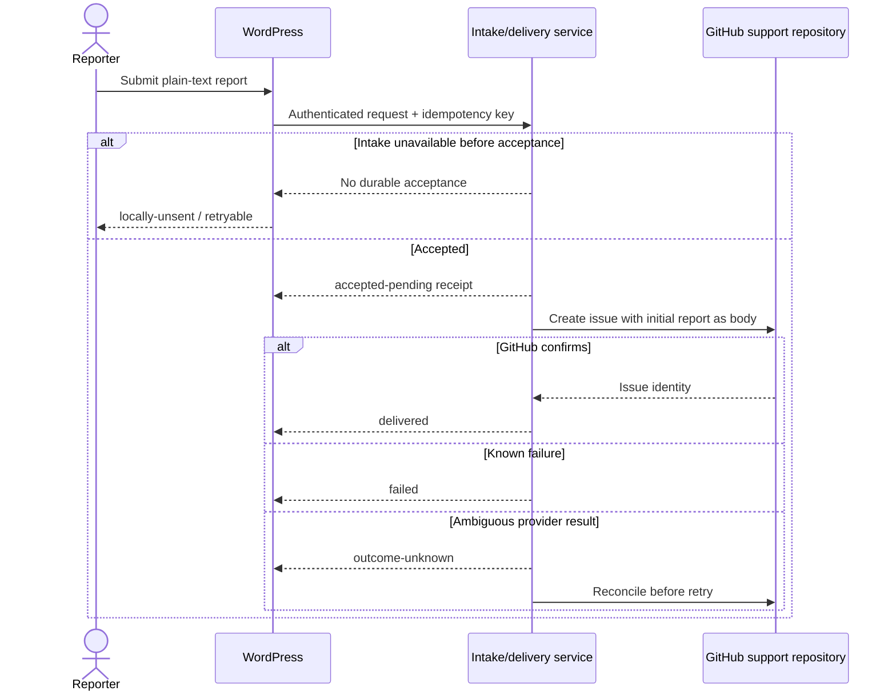
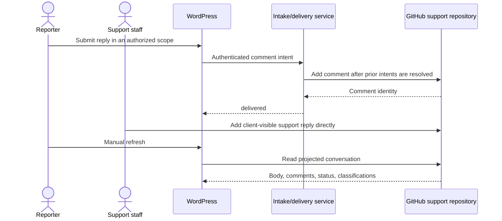
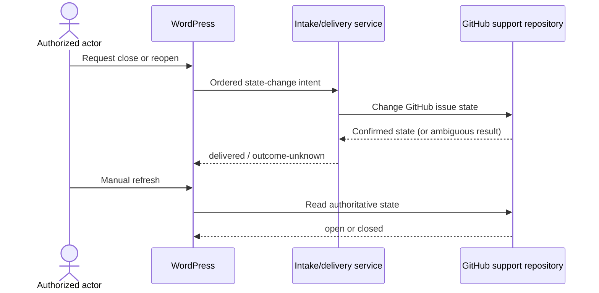
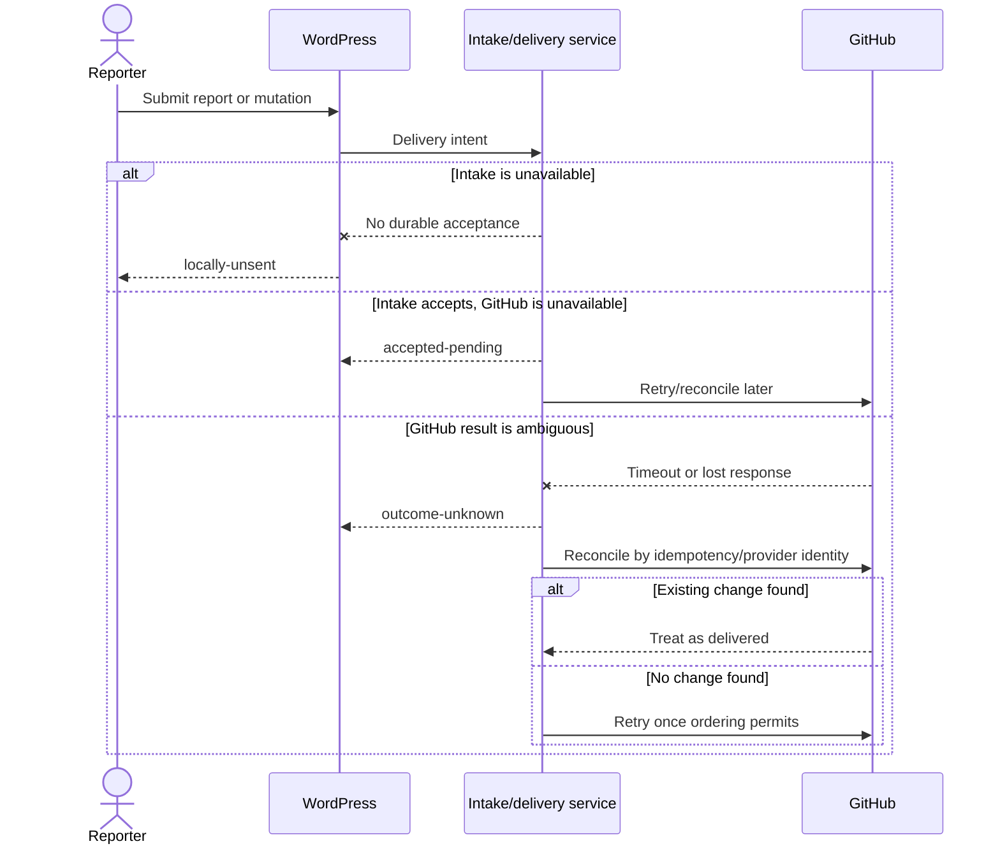

# Client support domain design

This record captures the decisions reached while grilling [GitHub issue #2](https://github.com/Quick-Release/gq-support/issues/2). It defines the domain boundary and MVP behavior; it does not authorize implementation of every optional subsystem.

The canonical glossary is [`CONTEXT.md`](../CONTEXT.md). Accepted architectural decisions are recorded in [`docs/adr/`](adr/).

## Context boundary

```text
Authenticated WordPress user
        |
        v
WordPress support UI + authenticated REST boundary
        |
        v
Intake/delivery service -------- operational records only
        |
        v
Approved client -> support-repository mapping
        |
        v
Dedicated private GitHub support repository
        |-- issue body: initial report
        |-- comments: client-visible messages
        `-- open/closed: support status

Engineering project issues remain separate and are not mirrored automatically.
The WordPress UI reads a projection and never becomes a competing support database.
```

## Identities and boundaries

- A **Client** is the customer support boundary and may have multiple WordPress installations and environments.
- A **WordPress installation** is a configured site; its environment distinguishes production, staging, and similar contexts.
- A **Reporter** is an authenticated WordPress user, not a GitHub user.
- A **Support request** is one client-facing conversation thread.
- A **Message** is an authored, append-only entry in that conversation.
- A **Support repository** is the client's dedicated private GitHub repository for client-visible support requests.
- An **Engineering issue** is a separate internal project issue; its comments are not automatically client-visible.

## Ownership and source of truth

| Concern | Authority | Projection or boundary rule |
| --- | --- | --- |
| Installation, environment, current WordPress user, and capabilities | WordPress | The service verifies the authenticated local identity and explicit visibility scope. |
| Client-to-installation-to-repository routing | Approved operator-controlled configuration | Reporters cannot select or change routing. One repository per client is normal; a per-installation exception requires explicit isolation approval. |
| Support request and initial report | GitHub support repository | The initial report is the issue body once delivered. |
| Client-visible messages | GitHub support repository | Later messages are comments. The support repository is a client-visible conversation surface. |
| Support status | GitHub support repository | `open` and `closed` are authoritative; the UI does not maintain a competing status. |
| Client-visible classifications | GitHub support repository | Only an allowlisted classification is projected. Internal engineering labels are excluded. |
| Reporter and installation attribution | Verified WordPress identity associated with each message | The GitHub App may be the provider author, but the human reporter and installation remain part of message attribution. |
| Repository and issue identities, idempotency, receipts, attempts, and reconciliation | Operational service | These records operate delivery and projection; they do not become a second conversation record. |
| Widget display | Read-only projection | The UI is never authoritative. |
| Attachments | Not in the MVP | Attachment metadata and storage require a later privacy and authorization decision. |

## Authorization and visibility

| Actor | Scope | Allowed actions | Not implied |
| --- | --- | --- | --- |
| Reporter | Own requests by default | Create, view, reply, close, and reopen own requests | Access to another installation, client, or GitHub repository |
| Support manager | Explicitly granted scope over one installation or an approved set | View and act on requests in that scope | Access outside the granted scope |
| Support staff | The relevant private support repository | Reply, close, and reopen directly in GitHub | Internal project-issue comments becoming client-visible |
| Engineering collaborator | Internal project repositories/issues | Discuss and implement engineering work | Client-support visibility or mutation rights |
| Anonymous or unscoped user | None | None | Any support data or action |

Visibility is capability-based and independent of WordPress role names or GitHub membership.

## GitHub field semantics

- The initial report is the issue body.
- Every later client or support message is a comment.
- MVP messages are append-only; corrections are new comments rather than edits or deletions.
- GitHub `open`/`closed` is the support-request status.
- Labels are classification, not authorization or delivery state.
- Every support-repository comment is eligible for the client-visible conversation. Internal discussion belongs in a separate engineering issue.
- The provider identity of the GitHub App does not replace verified WordPress reporter and installation attribution.

## Delivery semantics

Delivery outcome is separate from support status:

1. `locally-unsent`: not durably submitted; no receipt exists.
2. `accepted-pending`: the delivery intent is durably recorded, but no GitHub identity is guaranteed.
3. `delivered`: the GitHub issue or comment identity is recorded and verified.
4. `failed`: delivery is known not to have completed and requires a new attempt.
5. `outcome-unknown`: GitHub may have accepted the change; reconcile before retrying.

Delivery intents have idempotency keys and preserve order per support request. A reply or close/reopen action cannot be accepted ahead of an unresolved request creation or earlier mutation. The system does not claim exactly-once GitHub side effects.

## Sequences

### Initial report



### Reply



### Close/reopen



Support staff may perform the same state changes directly in GitHub. The next projection refresh reflects GitHub's state.

### Provider outage and recovery



## MVP boundary

### First end-to-end slice

1. An authorized WordPress reporter submits a plain-text report.
2. The system returns an honest durable receipt/status.
3. The mapped private support repository receives the issue.
4. Support staff posts one client-visible reply.
5. The reporter sees the reply after manual refresh.

### Remaining MVP behavior

- Client replies from WordPress.
- Close and reopen actions within the actor's explicit scope.
- Viewing own requests or requests within an explicit support-manager scope.
- Manual refresh of the GitHub-backed projection.

### Deferred

- Anonymous/public reporting.
- Live sockets, polling, and live chat.
- Session recording.
- AI triage.
- Autonomous coding.
- Screenshots, attachments, and R2.
- Rich diagnostics/context collection.
- A local WordPress outbox.
- Automatic engineering-issue creation or workbench handoff.
- Additional notifications beyond explicit UI status.

## Explicit follow-up boundaries

Issue #2 does not settle the following; they remain in the linked implementation/research slices:

- GitHub App permissions, installation authentication, and credential rotation.
- Onboarding/configuration storage and lifecycle.
- Shared versus dedicated Cloudflare resources.
- D1, Queues, R2, and webhook adoption.
- Privacy, retention, export, and erasure.
- Measured performance budgets.
- WordPress REST, build, CI, and operational details.
