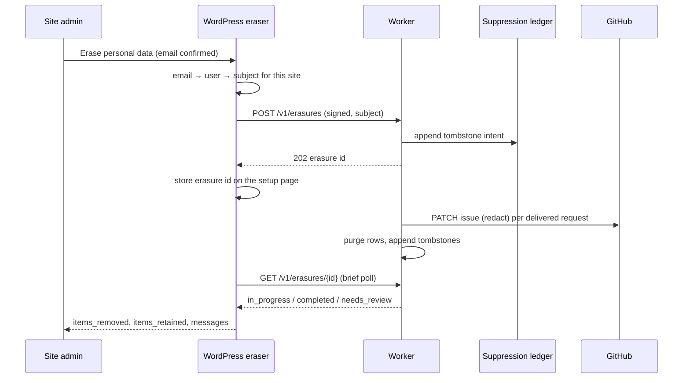
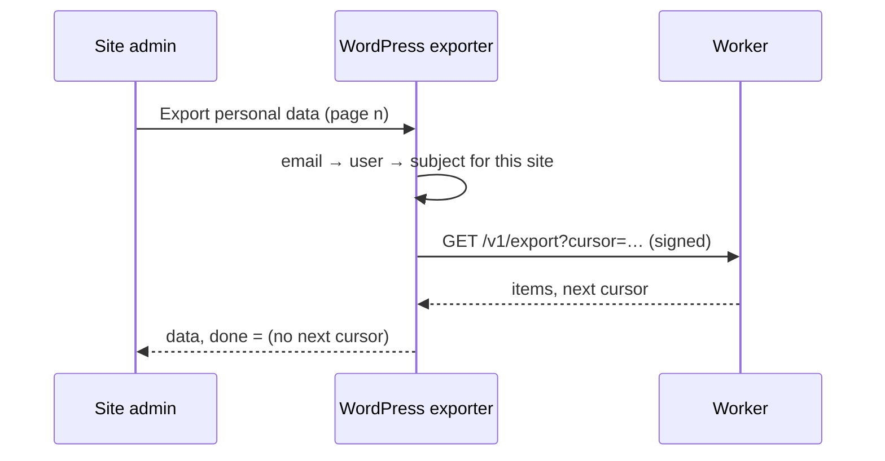

# Support privacy design

Decision record for [issue #16](https://github.com/Quick-Release/gq-support/issues/16). It covers what personal data the plain-text MVP holds, where it goes, how long each store keeps it, and how export and Reporter erasure work across WordPress, the Worker and GitHub. [ADR 0016](adr/0016-restores-never-rewind-revocations-or-deliveries.md) covers restores and the suppression ledger. [ADR 0017](adr/0017-d1-in-the-eu-jurisdiction.md) sets the D1 jurisdiction. [ADR 0018](adr/0018-erasure-redacts-github-and-reports-residual-copies.md) decides erasure in GitHub. Terms are defined in [CONTEXT.md](../CONTEXT.md). These are engineering requirements, not a compliance certification. This is a design, not a claim that it is implemented.

## Roles

The Client is the controller for its Reporters' data, and GETQUICK acts as its processor. A Reporter exercises their rights through the Client: the Client's site admin runs WordPress **Tools → Export/Erase Personal Data**, or tells GETQUICK, and an Operator runs the erasure. GETQUICK has no Reporter-facing intake for these requests.

## Scope and release gating

This covers the **plain-text MVP** only: Submitted text, Support status and Delivery outcome. Diagnostics (#14) and attachments or screenshots (#15) are **release-gated**. Before either ships, it must:

1. add its rows to the inventory below, with a purpose, minimum fields, destination, access, retention and deletion owner;
2. add its opt-in collection copy and its privacy-guide paragraph;
3. extend export and erasure to cover its data, including abandoned uploads for #15;
4. add its tests to the list at the end of this document.

## Data inventory and retention

| Data | Where | Purpose | Access | Retention | Deletion owner |
|---|---|---|---|---|---|
| Draft Summary and Description | Browser memory | Composing a request | The Reporter | Until reload, navigation or user switch. Never persisted | Browser |
| Reporter subject | WordPress user meta for that site | Pseudonymous ownership key | WordPress server | Until the user is deleted | WordPress (user deletion triggers erasure, see below) |
| Submitted text, Reporter subject, Submission ID, digest | D1 `support_request` | Reporter list, idempotency | Worker, scoped by Slot | Until **12 months after the last observed close**. Open requests are kept; a reopen resets the clock | Service purge job; erasure |
| Repository and issue IDs, status projection | D1 `support_request` | Delivery, status sync | Worker | With the request | As above |
| Delivery intent and bookkeeping | D1 `delivery_intent` | Delivery outbox | Worker | With the request | As above |
| `context_json` | D1 `delivery_intent` | Server context for the issue body (#14) | Worker | Set to `NULL` at a terminal state | Delivery |
| Issue title and body | GitHub, Project repository | The Client's engineering record | Project collaborators | The Client's repository policy | Redacted on erasure; otherwise the Client |
| Pseudonymous attribution (environment, installation reference, short subject hash) | GitHub issue body | Letting Developers ask an Operator about a request | Project collaborators | With the issue | Not personal data by itself; kept by redaction |
| GitHub notification emails | Mailboxes of watchers and assignees | GitHub behaviour | Recipients | Outside our control | **Residual copy** |
| Enrollment codes, keys, revocations, replay rows | D1 | Installation authentication | Worker, Operators | As in [storage design](support-storage-design.md). Keys and revocations are kept | Service |
| Suppression ledger | Separate D1 per stage, never restored with the main one | Stopping restores from bringing erased data back | Worker, Operators | **45 days**, then compacted | Service |
| Worker logs | Workers Logs | Operations | Operators | Workers Logs default; no Logpush in the MVP | Cloudflare. Out of erasure scope because logs hold no subject or text |
| D1 Time Travel history | Cloudflare | Recovery | Operators | 30 days (Paid plan) | Cloudflare; guarded by the ledger |

**Location.** D1 is created with `jurisdiction: "eu"` (ADR 0017). Workers execute wherever the request lands, and the GitHub repository is hosted by GitHub. Any data-location statement to a Client must name all three.

**Logs.** A log line may contain the request `id`, the Slot, the intent `id`, an error class and an HTTP status. It must never contain Submitted text, the Reporter subject or its hash, the Submission ID, email, names, cookies, nonces, signatures or tokens.

## GitHub attribution

The issue body holds the environment, a short installation reference and a short hash of the Reporter subject. It never holds a display name, username, email or WordPress user ID. A Developer who needs to know who reported a request asks an Operator. The Operator asks the Client, who can map the hash back to a user on their own site.

## Identity matching

WordPress privacy tools identify a person by email address, while the service identifies a Reporter by a subject that belongs to one site. The email address never leaves WordPress:

1. The exporter or eraser receives an email address and finds the user with `get_user_by( 'email', … )` on the **current** site.
2. It reads that user's Reporter subject for the current site. If there is none, it reports "no data" without calling the service.
3. It sends a signed request with the current installation's key. The Worker resolves the Slot from the key and never from the request body, and it acts on `(slot, reporter_subject)` only.

This means a request made on one site can never export or erase another site's or Client's records, even when the same email address is registered on both. Staging and production sites are separate Slots, so each site admin runs its own request.

## Worker contract

These routes are signed like every other call from WordPress to the Worker ([API contract](support-api-contract.md)). The attested subject and the Slot of the verified key are their only scope.

| Route | Behaviour |
|---|---|
| `GET /v1/export?cursor=` | Pages through the subject's own requests in the Slot, including superseded ones. Each item has the request `id`, Summary, Description, `created_at`, Support status and Delivery outcome. It never includes repository or issue IDs, the digest, the Submission ID or installation IDs. Requests visible only through a Support manager scope are excluded. |
| `POST /v1/erasures` | Idempotent per `(slot, reporter_subject)` while an erasure is open. Returns `202` with an erasure `id` once the erasure is **recorded**: written to the main D1 and to the suppression ledger. A failed write returns `503` and nothing has been recorded. |
| `GET /v1/erasures/{id}` | State, counts (`purged`, `redacted`, `pending`), and a list of residual-copy kinds. It never includes text. |

The Operator CLI has `erase <slot> --subject-hash <h>` for erasures the Client asks for outside WordPress, and `erasure close <id>` once an Operator has reviewed the residual copies. Both are audited.

### Erasure states

`recorded` → `in_progress` → `completed` or `needs_review` → `closed`

- **completed**: every request was purged or redacted, and no residual copy is known beyond the standard notice about notification emails.
- **needs_review**: something needs a person. For example, the issue was retitled by a Developer, the issue has comments, redaction failed repeatedly, or the repository is suspended.
- **closed**: set only by an Operator.

### What happens to each request

| Create intent state | Action |
|---|---|
| `pending`, `failed` | Cancel the intent so it never POSTs, then purge the row |
| `in_flight`, `outcome_unknown` | Wait for marker reconciliation. If an issue is found, redact it and then purge. If none exists, purge |
| `delivered` | Redact the issue, then purge the row |
| Tracking `lost` (issue deleted or transferred away) | Purge, and record a residual-copy note if the issue was transferred |

**Redaction** is a `PATCH` to the issue by the App:

- **Body:** keep the first-line marker and the attribution. Replace the fenced Reporter text with `Support request text erased at the Reporter's request.`
- **Title:** if it still equals the title the App derived at acceptance, replace it with `Support request (erased)`. If a Developer changed it, leave it and mark `needs_review` (`retitled`).
- **Comments:** never edited. If the issue has any comments, mark `needs_review` (`comments`), because a Developer may have quoted the text.

GitHub keeps the previous body in the issue's **edit history**. Anyone with write access can delete a revision, but the App cannot, so every redacted issue adds a `edit_history` residual copy for an Operator to delete by hand.

## Sequence: WordPress eraser

The eraser callback **never** returns `items_retained: false` while a remote step is outstanding or a residual copy is known. If the erasure has not finished within the brief poll, the callback returns `done: true`, `items_retained: true` and a message saying erasure is continuing. The Support setup page lists each erasure and its state until an Operator closes it. If the Worker is unreachable, the callback returns an error and the admin retries. A failed `POST` has recorded nothing, so a retry is safe.

## Sequence: export

The WordPress page number maps to the Worker cursor, which is stored in a short-lived transient keyed by the request. A Worker failure returns an error for that page, and WordPress lets the admin retry it.

## Deleted WordPress users

The Reporter subject is stored in user meta, so it disappears when the user is deleted. On `delete_user` (and `wpmu_delete_user` on multisite), the plugin reads the subject **before** deletion and sends a best-effort signed `POST /v1/erasures`. If that fails, it is queued for one retry in the plugin lifecycle. After that, the records still fall under the 12-month retention. No email-derived lookup is kept. Removing a user from one site of a multisite network does **not** trigger erasure, because the user may be re-added.

## Offboarding, disconnect and uninstall

| Event | Local effect | Service effect |
|---|---|---|
| Reporter erasure | None beyond the eraser's record | That subject's rows in that Slot are purged, and their issues redacted |
| Disconnect (site admin) | Keys deleted | Best-effort key revocation. Records stay under retention |
| Deactivate | None | None |
| Uninstall | Local state, key and capability grants deleted. No remote call | None. Records stay under retention |
| **Offboarding** (`revoke <slot>` by an Operator) | n/a | Key revoked. After a **30-day grace period**, all of the Slot's `support_request` and `delivery_intent` rows are hard-purged, with a Slot tombstone in the ledger. Keys and revocation rows are kept. GitHub issues are never touched: they belong to the Client's repository |

None of these touches another Slot's records, the Project repository itself, or the shared Cloudflare resources.

## Preventing resurrection

- **Restore:** before serving traffic after a restore, the Worker replays the suppression ledger (ADR 0016). Each tombstone purges the matching rows again, and redaction runs again for any issue listed.
- **Webhooks and sweeps** fetch GitHub and overwrite status only. When a lookup by `(repository_id, issue_id)` finds no row, the event is dropped. They never create a row.
- **Delivery:** an intent whose request `id` is in the ledger never POSTs.
- **Tombstones** hold the request `id`, `(repository_id, issue_id)`, the intent `id` and the erasure time. They hold no text and no subject. After **45 days**, beyond the 30-day Time Travel window, they are compacted away.
- **Retention purges** do not go to the ledger. A restore that brings back a request purged for age only brings back data the Client would have kept anyway, and the next purge run removes it again.

## GitHub and provider limitations

| Limitation | Consequence |
|---|---|
| The App cannot delete issues | Redaction, never deletion (ADR 0018) |
| Edit history keeps earlier bodies; only a person with write access can delete a revision | A residual copy after every redaction; Operator review |
| Notification emails cannot be recalled | Listed as a standard residual copy in the privacy-guide text |
| Developers can quote Reporter text in comments or other issues | `needs_review` when the issue has comments; the Operator handles it with the Client |
| A Developer can retitle an issue | `needs_review` (`retitled`) |
| GitHub backups and logs | Outside our control. Disclosed |
| D1 Time Travel keeps 30 days of history | Guarded by the ledger |
| Workers execute outside the EU | Disclosed; ADR 0017 is not a location claim |

## Privacy-guide text (draft)

Registered with `wp_add_privacy_policy_content()` under the plugin's name. This is a suggestion for the site owner to adapt, not legal advice.

> **Support requests.** When you send a support request from this site's admin area, the summary and description you write are sent to our support provider, GETQUICK, which stores them on Cloudflare (database in the EU) and creates an issue in this project's private GitHub repository so that the development team can work on it. Your name, email address and username are not sent. The request is linked to you through a random identifier that is kept on this site. GitHub may email notifications of new issues to members of the development team.
>
> Support requests are kept by GETQUICK for 12 months after they are closed. The issue in GitHub stays part of this project's engineering history. If you ask this site to erase your personal data, your requests are deleted from GETQUICK's service and the text of your requests is removed from the GitHub issues. Copies that we cannot remove automatically, such as notification emails and earlier versions kept in GitHub's edit history, are reviewed and deleted by hand where possible.

## Human review points

These need legal or contractual review and are not engineering decisions:

- the Client agreement and data processing terms, with GETQUICK as processor;
- the sub-processor list (Cloudflare and GitHub) and how transfers to GitHub are described;
- the final privacy-guide wording for each Client deployment;
- how an Operator handles `needs_review` erasures together with the Client.

## Required tests

1. **Cross-tenant email confusion:** the same email on two sites, including two Slots of one Client and two Clients. Exporting or erasing on one site returns and removes only that Slot's subject records.
2. **Missing subject:** a user who never submitted gets "no data" without a service call.
3. **Erasure across delivery states:** `pending`, `failed`, `in_flight`, `outcome_unknown`, `delivered` and `lost` each end in the action shown in the table. A cancelled intent never POSTs.
4. **Redaction:** the marker and attribution are kept, the text is replaced, a derived title is replaced, a retitled issue is left and flagged, and an issue with comments is flagged.
5. **Honest completion:** the WordPress eraser never returns `items_retained: false` while the erasure is `in_progress` or `needs_review`, or when the Worker is unreachable.
6. **Replay and restore after erasure:** restoring D1 to before an erasure, then replaying the ledger, removes the rows again and keeps the intent from POSTing. Webhook and sweep events for an erased issue create nothing.
7. **Deleted user:** `delete_user` sends the erasure with the subject read before deletion. Removing a user from a site sends nothing.
8. **Offboarding:** the grace period is honoured, only that Slot is purged, and a staging Slot sharing the repository is untouched.
9. **Logs contain no secrets or content:** log fixtures from accept, deliver, erasure and export paths contain no text, subject, subject hash, Submission ID, nonce, signature or token.
10. **Retention purge:** closed requests over 12 months are purged; an open or reopened request is not.
